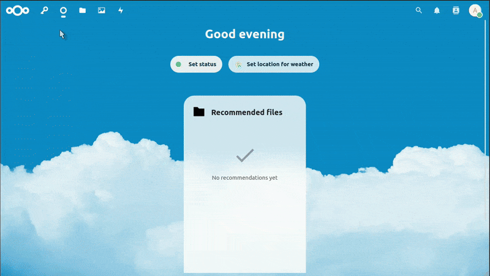

## Find and Review Nextcloud Logs

Nextcloud logs are helpful to get percise information about what happened when an error occured.
The logs can be viewed from the admin area.
Go to "Settings" > "Logging" to view the logs.

You can use the log level filter to exclude irrelevant events from the list and find the relevant events faster.
Errors created logged by the passwords app can usually be identified by checking the app column.
But there are some cases where the app could be listed as "index", "no app in context" or "PHP" instead.

If you have found the correct log entry, click on the "copy" icon and select "copy raw" to copy the log entry.
