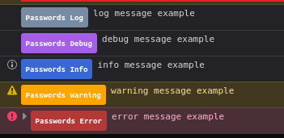

## Find and Review Nextcloud Logs

Nextcloud's logs are helpful to get precise information about what happened when an error occurred.
The logs can be viewed from the admin area.
Go to "Settings" > "Logging" to view the logs.

You can use the log level filter in the "Log reader settings" to exclude irrelevant events from the list and find the relevant events faster.
Errors logged by the passwords app can usually be identified by checking the "Application" column.
However, in some cases the Application could be listed as "index", "no app in context" or "PHP" instead.

If you have found the correct log entry, click on the `⋯`-Menu on the right and select "Copy raw entry" to copy the log entry.

## Find the system information
If you have command line access, you can get the server information with the command `php ./occ passwords:system:report debug` in the root directory of your Nextcloud installation.
If you have [occweb](https://apps.nextcloud.com/apps/occweb) installed, you can get this information with `passwords:system:report debug`.

#### Nextcloud Version
The Nextcloud version can be found in the "Overview" section in the admin area.
Go to "Settings" > "Overview" and take a look at the section "Version".

#### Environment
If the "Monitoring" app has not been disabled, it will help to gather system information quickly.
Go to "Settings" > "System" in the admin area to check the PHP and database information.

## Check the browser log
In most browsers you can open the developer tools with "F12".
In Opera you need to click "Ctrl+Shift+C" to do so.

Make sure that you are in the "Console" tab.

**There may be a [warning message](../../../Users/Browser-Console) about using the console. You can ignore it in this case**

Most of the information there is not necessary, so it might be good to filter the log.
In any Chromium based browser (Chrome, Edge, Vivaldi, Opera) click on "Default levels" and uncheck "Info".
In any Firefox based browser uncheck "Log", "Information" and "Debug" in the top right corner.

Now there should only be warnings and errors.

