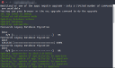
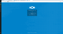

# Passwords 2020.1.0 and newer no longer support the legacy migration. You need to use [2019.12.1](https://git.mdns.eu/nextcloud/passwords/-/jobs/9150/artifacts/raw/passwords.tar.gz) for the migration

This guide helps you to migrate fom the [Passwords Legacy](https://github.com/marius-wieschollek/passwords-legacy) app written by Fallon Turner and maintained by Marius Wieschollek.
If you did not use the legacy app or want to [start from scratch](#starting-from-scratch), this guide is not relevant for you.

### Why you should upgrade
Since the release of Passwords 2019.1 at the beginning of 2019, Passwords Legacy is entirely unsupported and does not receive any updates or security patches at all anymore.
Passwords is more secure, faster and comes with a more powerful api and a modern webinterface.

### Prerequisites
Make sure to upgrade to the latest version of the [legacy app](https://github.com/marius-wieschollek/passwords-legacy) before attempting the migration.
Check the [system-requirements](../../System-Requirements) and make sure your server fulfills all the minimum requirements.
The migration works **only** up to PHP 7.1. If you can not use PHP 7.1, perform the migration on the developer docker system and copy the databases and configuration for the app back to your productive system.
You also need the **mcrypt** module for PHP for the migration. The developer docker system does **not** have mcrypt installed.
See [Mcrypt not installed](#mcrypt-not-installed) if you don't have it installed.
Since the app requires PHP 7.1 minimum, you can use the [migration build](../../_files/passwords.tar.gz) to upgrade if you are using PHP 5.6.
It might also be a good idea to check the issue trackers [on github](https://github.com/marius-wieschollek/passwords/issues) to see if any problems with the migration process have occurred.


### Database Backup
Passwords has no write capabilities for Passwords Legacy built-in and does not use the legacy tables.
It is still a good idea to make a backup of the following tables before you start the migration process.
**Do not keep this backup in any publicly accessible folder of your webserver**

```
*PREFIX*passwords
*PREFIX*passwords_categories
*PREFIX*passwords_share
```


### Setup Testing System
We do not recommend performing the update on a live system before testing it.
If you have a staging / testing environment use it to test the migration before migrating the live system.
If you used password sharing in the legacy app, you should import a complete dump of your live database since the migration will not migrate shares if the user it was shared with does not exist.
After importing the database dump from the previous step and set the `passwordsalt` to the same value as on your live system.
Make sure to set the `installed_version` value on your testing system to `2017.12`:
```bash
./occ config:system:set passwordsalt --value <yourpasswordsalt>
./occ config:app:set passwords installed_version --value 2017.12
```
Please note that the migration will check the security status of all passwords during the migration.
By default this is done with the [haveibeenpwned.com](https://haveibeenpwned.com/) web service.
You can change this with the following sql statement:
```bash
./occ config:app:set passwords service/security --value bigdb
```
Lastly you should know that every time you start the migration, it will try to import all categories, passwords and shares.
So in order to prevent duplicate passwords, you should empty the password tables if you have to start the migration process anew.


### Migration
Install the newest version of Passwords from the [app store](https://apps.nextcloud.com/apps/passwords).
Nextcloud should detect the new version and activate the maintenance mode.
You can start the migration by clicking the upgrade button on the web interface or by using the command line tool.
We recommend using the command line tool for the migration.
Execute the following command in the root directory of your Nextcloud installation to use it.
```bash
./occ upgrade
```
If the migration was successful, the number of migrated passwords, categories and shares should be listed in the log.

[](../../_files/01-migration-shell.png)
[](../../_files/02-migration-browser.png)


### Post Migration Steps
- Check the Webinterface of the apps to see if any problems can be found
- If you are sure that everything works, delete the legacy tables
- After the migration, shared passwords might not be shown in the receivers account for some time. (See [known issues](#known-issues))
- If you did not use haveibeenpwned.com during the migration, the security status might be wrong for up to 24 hours. (See [known issues](#known-issues))
- Check the [known issues](#known-issues) if you encountered any problems
- Check the admin settings page


### Known Issues
###### Shared passwords are not shown
This is due to the way shares work in Passwords.
The shared passwords will be added to the receivers account by a background cron job.
If you want to speed up the process, execute the cron jobs manually
```bash
php ./cron.php
```

###### Migration does not start
In some rare cases it migth happen that the migration tool is not executed when the app is updated.
In this case, the following commands should help to run the migration tool:
```bash
./occ config:app:set passwords installed_version --value 2017.12
./occ upgrade
```

###### Security status of passwords is not correct
If you use one of the local databases for bad passwords, passwords might get marked as secure even if they are not.
The password databases have to be downloaded before passwords are checked correctly.
This is done by a background cron job and can take up to one day.


###### Mcrypt not installed
Mcrypt is no longer installed by default starting with PHP 7.1
You can install it manually using [pecl](https://pecl.php.net/support.php).
If you do not have pecl, install it with `sudo apt install php-pear` (on Debian/Ubuntu).

```
# If you're on your server
sudo su

# If you're using the developer system
docker exec -it passwords-php bash


apt-get update
apt-get install libmcrypt-dev


# Use Version 1.0.2 for PHP 7.3
pecl install channel://pecl.php.net/mcrypt-1.0.3

# If you installed PHP with apt
phpenmod mcrypt

# If you use the Nextcloud docker container or the developer system
echo "extension=mcrypt.so" > /usr/local/etc/php/conf.d/docker-php-ext-mcrypt.ini
```

###### Not listed issues
If your issue is not listed here, try the [public issue tracker](https://github.com/marius-wieschollek/passwords/issues).
Please describe your issue in detail and precise and supply all necessary information to find a solution.


### Starting from scratch
If you have used passwords legacy but do not want to migrate your old data you can just disable the migration tool by setting the `installed version` to `2018.0`.
Make sure you also delete the legacy app tables from your database.
```bash
./occ config:app:set passwords installed_version --value 2018.0
```
