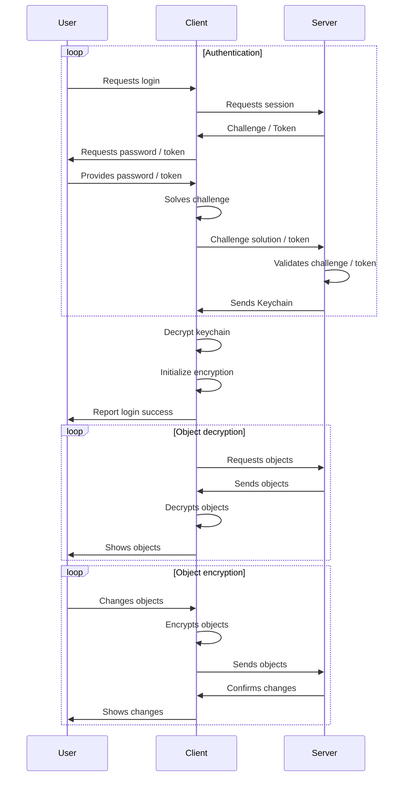

### How does Passwords implement CSE/E2E
Passwords uses [Libsodium](https://download.libsodium.org/doc) to encrypt and decrypt user data.
Implementations of Libsodium are available for many different programming languages and usually provide a very similar api.
The library also provides good performance and security while being comparably easy to use.
E2E in Passwords is designed to be upgradeable which is why every part of it is implemented separately and has its own version information.

### Encryption and Token types
##### Password challenge
| Type | Description |
| --- | --- |
| [`PWDv1r1`](./Encryption/PWDv1Challenge) | The standard master password challenge |

##### Keychains
| Type | Description |
| --- | --- |
| [`CSEv1r1`](./Encryption/CSEv1Keychain) | The standard CSE keychain |

##### CSE/E2E encryption
| Type | Description |
| --- | --- |
| `none` | An object without any client side encryption. Only available with SSE other than `none` |
| [`CSEv1r1`](./Encryption/CSEv1Encryption) | The standard CSE encryption |

##### SSE encryption
| Type | Description |
| --- | --- |
| `none` | An object without any server side encryption. Only available with CSE other than `none` |
| `SSEv1r1` | An object with first generation server side encryption. Uses a server key, user key and object key |
| `SSEv1r2` | An object with second generation server side encryption. Uses the Nextcloud secret, user key and object key |
| `SSEv2r1` | An object with secure server side encryption. SSEv2 uses a keychain which is remporarily decrypted with the challenge secret |

##### 2FA token
| Type | Description |
| --- | --- |
| [`user-token`](./Token#user-token) | A token where the user has to enter a code |
| [`request-token`](./Token#request-token) | A token where a second device or app is used for confirmation |

### Graphical schema of the encryption flow
