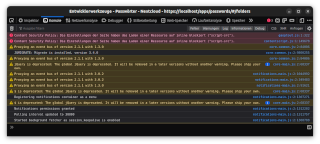
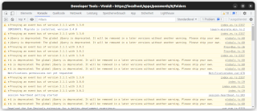

## What is the browser console

The "browser console" or "developer console" is a feature that exists in all major modern browsers.
It is intended for developers who are building the website to help them troubleshoot issues and create new features.
The console can be used to inspect and change the source code and structure of the page.

## Someone told me to copy & paste something into the console

> :warning: Don't copy and paste things into the console. This can allow others to hack __your__ account.

In some places on the internet, you may be told to "copy & paste this into the console" to unlock cool features, access hidden functionality of the website or hack someone else's account.
That's not how this works. All features of the Passwords app for Nextcloud can be accessed through the user interface, there are no features which can be enabled from the console.

Pasting something into the console will run that as code on the website.
In the case of the Passwords app this code will have access to all your passwords in the app, your Nextcloud account and maybe more.
That means that the code can get all your private data and send it to someone else.
Therefore, you should never paste anything you don't fully understand into the browser console.

## Someone told me to copy something from the console

> :warning: The console may contain private data.

The console gives access to all parts of the website: The source code that makes the website you see, the communication with the server, data stored on your device and the log of what the
website did since you opened it.
So the data you see here may be private data of you, including your passwords and nextcloud account credentials that you should not share with others.

If you're reporting a bug to the developers of the Passwords app, you may be asked to share the log from the browser console.
In that case you should always review the log before posting it online and remove all personal data from it.

## I copied something into the console, what now?

1. **Speak to your IT Support or Administrator. Explain what you did, show them what you pasted and follow their instructions.**
2. Confirm this with your IT support first: Clear your browser history, make sure to clear "Cookies", "Cache", "Active Logins", "Website Settings" and "Website Data". These may be called a
   little different in your browser.
3. Log in with Nextcloud again, go into your personal sections and there into the security section. Scroll to the "Devices and Sessions" part and revoke access for all devices listed there.
4. Change all your passwords. Not just Nextcloud, but all passwords for all accounts you have in the passwords app.