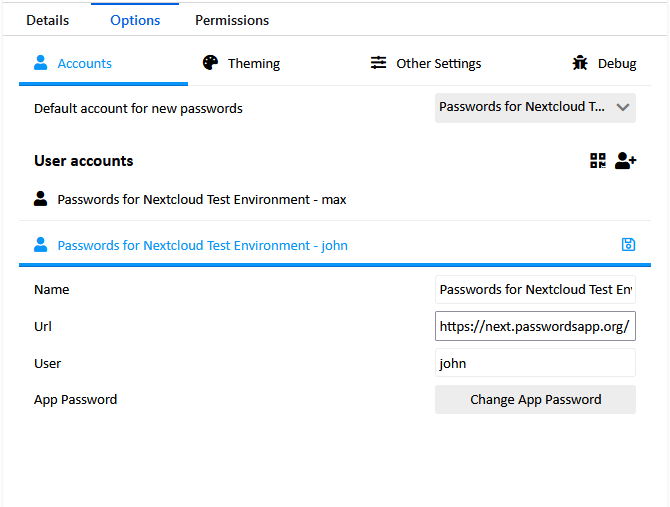

### Default account
The setting "Default account for new passwords" specifies which account should be used as default.
This account is used to save new passwords, fetch favicons and generate passwords.

If the default account is deleted, the extension will automatically select a new default account.

### User accounts list
This list shows all currently connected accounts.
The icons on the right allow adding new accounts, either by scanning a PassLink QR Code or manually entering the account information.

##### Manually adding accounts
See the [manual setup guide](./Setup/Setup-manually) for more details about adding accounts manually

##### Updating account details
Once you click on account name, a form with the account details will open.
Change the fields as desired and then click the "💾" icon next to the account name to save the account.

To change the App Password, see the [Update Nextcloud Credentials guide](./Update-Nextcloud-Credentials).

##### Delete an account
Close the account details form if open by clicking on the account name.
Click the "🗑" next to the account name to delete it.