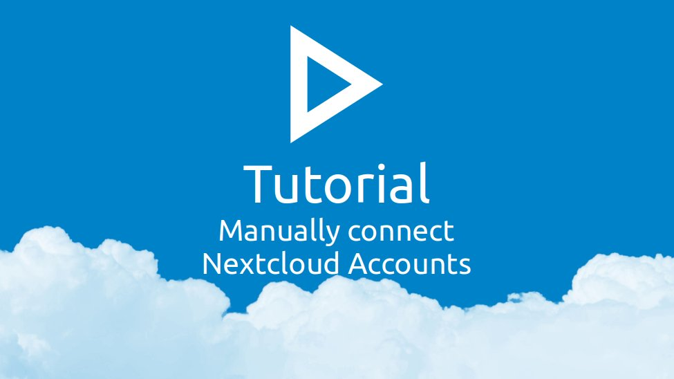

.

#### Installation
1. Open the Passwords App in Nextcloud
2. Click on "More"
3. Click on "Apps & Extensions"
4. Locate the browser extension entry for your browser and click the button to open the extension page in the official extension store
5. Install the extension from the extension store

#### Adding an account
1. Open Nextcloud, click on your profile icon in the top right corner and click on "Settings"
2. Open the "Security" section on the left
3. Scroll down to "Devices & Sessions".
4. At the end of your device list, there should be a form to create a new "App password"
5. Enter a name for the Extension into the "App name" input field
6. Click "Create new app password"
7. Authenticate with your Nextcloud password if required
8. Use the "📋" to copy the token from the "Password" field
9. Open the extension popup by clicking on the extension icon
10. Open the last tab called "Tools" and click "Open Extension Settings"
11. Click on the "👤" icon
12. Enter a name for the new account in the "Name" field
13. Enter the base URL of your Nextcloud in the URL field.
    - If Nextcloud is installed in a subfolder (e.g. `/nextcloud/`), the url must include that folder.
    - If you're unsure, just open the passwords app and copy the URL from the address bar
14. Enter the username which was displayed when you created the app password into the "User" field
15. Paste the app password you copied in step 8 into the "App password" field.
16. Click on the "💾" icon to save the account
    - A green success message "Account saved" should pop up.
