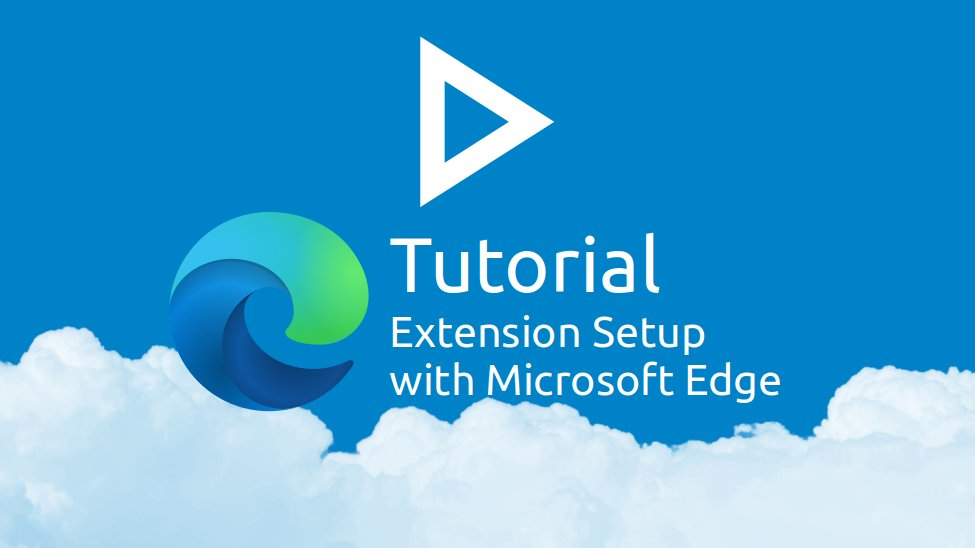

#### Installation
1. Open the Passwords App in Nextcloud
2. Click on the 🧩 icon to open "[Apps & Extensions](web+passlink://goto/apps)"
3. Locate the "Official Microsoft Edge Extension" and click on "Available in the Microsoft Store"
4. In the Microsoft Store, click the blue "Get" button to install the extension
5. Confirm the installation by clicking on the "Add extension" button in the dialog that opened
    - For easier access to the extension, right-click the extension icon and select "Show in toolbar"
6. Navigate back to "Apps & Extensions"
7. Locate the "Official Microsoft Edge Extension" again and click on "Connect with PassLink"
8. Click "Connect via Link" in the dialog that opens
9. A window from the extension should open and the dialog should switch to showing a set of four codes
10. Compare the codes and click on "Looks good" if they match
    - You can close both dialogs afterward

#### Allow in private browsing
1. Right-Click on the extension icon
2. Click on "Manage Extension"
3. Enable "Allow in InPrivate"

#### Confirm it's working
You can confirm that the extension is successfully connected with these steps
- Open the extension by clicking on the button with the Key icon
- Select the third tab called "Browse"
- There should be a list item for the account you just created. Click on it
    - It should list the content of your home folder.
- There is now a circled "ℹ" next to the name of the account. Click it
- You now see the details of how many Passwords, Folders and Tags the extension found
    - With the "🔄", you can refresh the data from the server