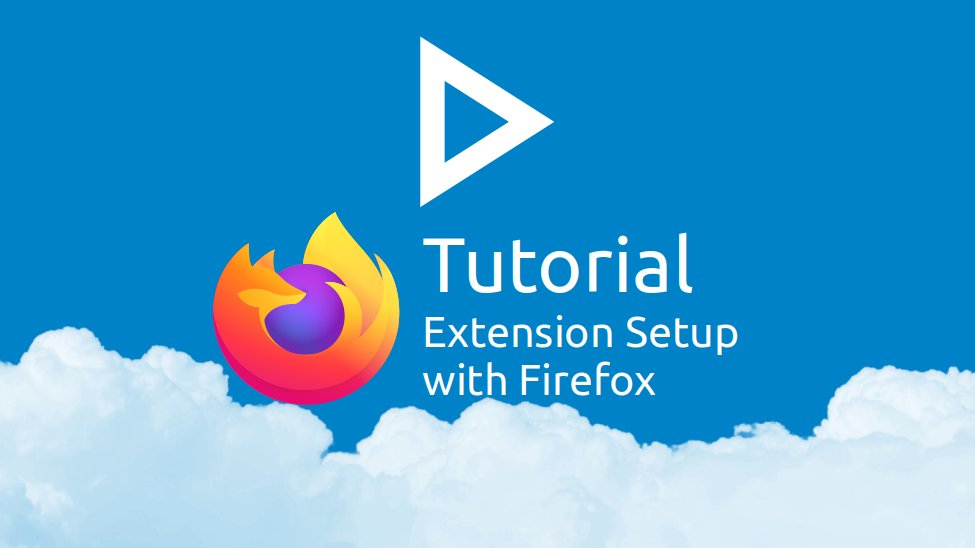

#### Installation
1. Open the Passwords App in Nextcloud
2. Click on the 🧩 icon to open "[Apps & Extensions](web+passlink://goto/apps)"
3. Locate the "Official Firefox Add-On" and click on "Available on Firefox Add-ons"
4. On the Firefox Add-ons page, click the blue "Add to Firefox" button to install the extension
5. Confirm the installation by clicking on the "Add" button in the dialog that opened
    - _IF_ you wish to use the extension also in private mode, check the option "Allow this extension to run in Private Windows" and click "Okay"
    - For easier access to the extension, click on the extension button, then click on the settings button on the Passwords Extension and click "Pin to Toolbar"
6. Navigate back to "Apps & Extensions"
7. Locate the "Official Firefox Add-On" again and click on "Connect with PassLink"
8. Click "Connect via Link" in the dialog that opens
9. A window from the extension should open and the dialog should switch to showing a set of four codes
10. Compare the codes and click on "Looks good" if they match
    - You can close both dialogs afterward

#### Confirm it's working
You can confirm that the extension is successfully connected with these steps
- Open the extension by clicking on the button with the Key icon
- Select the third tab called "Browse"
- There should be a list item for the account you just created. Click on it
    - It should list the content of your home folder.
- There is now a circled "ℹ" next to the name of the account. Click it
- You now see the details of how many Passwords, Folders and Tags the extension found
    - With the "🔄", you can refresh the data from the server