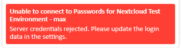
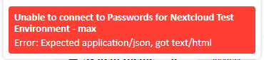
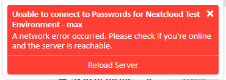

## Connection error messages
| Example                                                                                                                       | Description                                                                                                                                                                                                                                                                                                                                                                                            |
|-------------------------------------------------------------------------------------------------------------------------------|--------------------------------------------------------------------------------------------------------------------------------------------------------------------------------------------------------------------------------------------------------------------------------------------------------------------------------------------------------------------------------------------------------|
|        | The server has rejected the login credentials configured in the extension. [You need to reconnect the extension or update the credentials.](./Update-Nextcloud-Credentials)                                                                                                                                                                                                                            |
|                                               | The server responded with an unexpected data type, e.g. it responded with an HTML website instead of your passwords. Most likely this means that the server is having issues right now and doesn't work correctly. Ask your administrator for help. If you are the administrator see [app debugging](https://git.mdns.eu/nextcloud/passwords/-/wikis/Administrators/Guides/Maintenance/App-Debugging). |
|  | The server can't be reached. Either you're offline or the server is. Try opening Nextcloud in your browser to see what is going on. Click the "reload" option to try again.                                                                                                                                                                                                                                                                   |

## Debugging the extension

### Check the extension log
- Open the extension popup, go to the last tab, click "Open Extension Settings"
  - **OR** Right-click the extension icon, select "Options" (Chrome), "Extension Options" (MS Edge) or "Manage Extension" (Firefox)
- Open the last tab called "Debug"
- Scroll down to "Error log"

### Debug in Firefox
- Open a new tab and navigate to "about:debugging"
- Select "This Firefox" on the left
- Scroll to the "Passwords for Nextcloud Browser Extension" and click "Inspect"
- The developer tools should open in a new window
  - Use the "Console" tab to see errors and log messages
  - Use the "Network" tab to see requests to the server

### Debug in Chrome
- Open a new tab and navigate to "chrome://extensions"
- Enable the "Developer mode" switch in the top right corner
- Locate the "Passwords for Nextcloud Browser Extension" and click "Inspect views background page"
- The developer tools should open in a new window
    - Use the "Console" tab to see errors and log messages
    - Use the "Network" tab to see requests to the server

### Debug in MS Edge
- Open a new tab and navigate to "edge://extensions"
- Enable the "Developer mode" switch in the left sidebar
- Locate the "Passwords for Nextcloud Browser Extension" and click "Inspect views Background page"
- The developer tools should open in a new window
    - Use the "Console" tab to see errors and log messages
    - Use the "Network" tab to see requests to the server