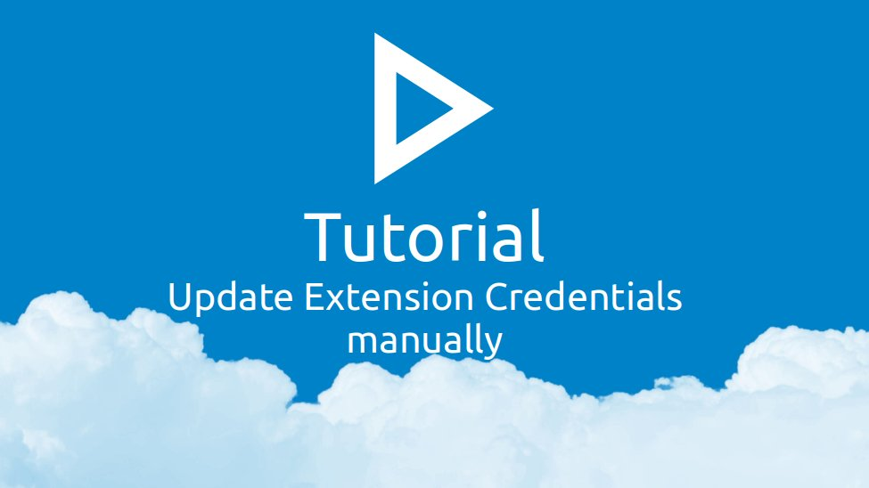

This article covers how to update the credentials used by the browser extension to communicate with Nextcloud.

### Update Login Credentials using PassLink

> :star: This method requires the browser extension version 2.5.0 or higher

1. Open the passwords app using the browser where the extension is installed
2. Click on "More", then "Apps & Extensions"
3. Locate the extension listing for your browser (Firefox, Google Chrome, Microsoft Edge) and click on "Connect with PassLink"
4. Click "Connect via Link" in the dialog that opens
5. A window from the extension should open and the dialog should switch to showing a set of four codes
6. Compare the codes and click on "Looks good" if they match
    - You can close both dialogs afterward

### Update Login Credentials manually

1. Open Nextcloud, click on your profile icon in the top right corner and click on "Settings"
2. Open the "Security" section on the left
3. Scroll down to "Devices & Sessions".
4. At the end of your device list, there should be a form to create a new "App password"
5. Enter a name for the Extension into the "App name" input field
6. Click "Create new app password"
7. Authenticate with your Nextcloud password if required
8. Use the "📋" to copy the token from the "Password" field
9. Open the extension popup by clicking on the extension icon
10. Open the last tab called "Tools" and click "Open Extension Settings"
11. Click on the account whose credentials you want to update in the "User accounts" list
12. Click "Change App Password"
13. Paste the app password you copied in step 8.
14. Click on the "💾" icon to save the account
    - A green success message "Account saved" should pop up.
