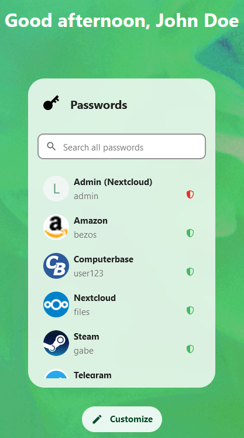

The Passwords App dashboard widget allows quick and easy access to your passwords directly from the dashboard.

### Adding the Dashboard widget
1. Open the dashboard and click the "Customize" button
2. Check the checkbox for the "Passwords" entry in the "Edit widgets" dialog
3. Close the "Edit widgets" dialog

### Using the Dashboard widget
The dashboard widget is straightforward to use.
By default, it will display your favorite passwords.

Clicking and Double-Clicking passwords will perform the configured click actions if those are available within the widget.
(By default these are "Copy Password" and "Copy Username")

### Searching passwords
With the "Search all passwords" input field at the top of the widgets, it's easy to search through all your passwords.

> :star: Sometimes it can take a little longer to load all passwords.
> In that case you will see a corresponding message and the search will be rerun once all passwords are loaded.