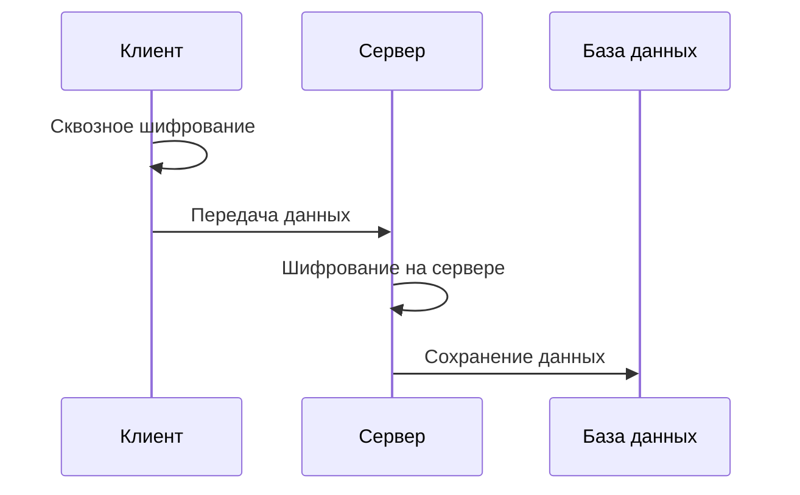

Passwords поддерживает несколько разных типов шифрования.
Два основных типа шифрования: клиентское/сквозное шифрование, и шифрование на сервере.
Со сквозным шифрованием, данные зашифрованы на вашем устройстве выбранным вами паролем *до* отправки на сервере.
С шифрованием на сервере, данные шифруются перед сохранением в базе данных.

### Включение сквозного шифрования
Смотрите [Включение сквозного шифрования](./Encryption/Enable-End-to-End-Encryption).

### Типы шифрования
Смотрите [Типы шифрования](./Encryption/Encryption-Types).
