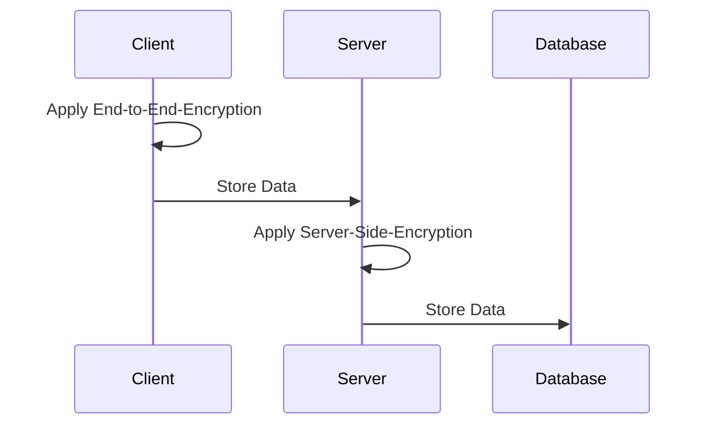

The passwords app supports different types of encryption to keep your data safe.
The main classes of encryption provided are client side encryption (also known as end-to-end encryption) and server side encryption.
With client side encryption, the data is encrypted on your device with an encryption password chosen by you before it's sent to the server and stored there.
With server side encryption, the data is sent to the server and encrypted there before it's stored.

### Enable End-to-End Encryption
See [Enable End-to-End Encryption](./Encryption/Enable-End-to-End-Encryption)

### Encryption Types
See [encryption types](./Encryption/Encryption-Types).