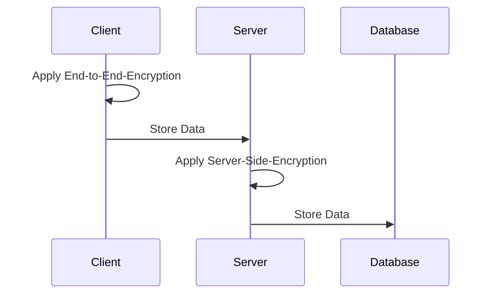

## Server-Side Encryption
Server-Side encryption is used on the server before the data is stored in the database.

#### None
If the client already encrypted the password, the server does not need to add additional encryption.

#### SSEv1
This is a basic server side encryption which creates an individual encryption key for each password.
The key is generated using the server-wide Nextcloud secret, an user specific key and a per-item key.
This type of encryption does not require a master password.
It can protect in cases where an attacker has only access to some parts of the server or only access to the server database.

#### SSEv2
This encryption uses an encrypted keychain to store the keys used to decrypt passwords.
The password to decrypt the keychain is generated by the client using the master password provided by the user.
This way, the keychain is only accessible when the user is logged in.

## Client-Side Encryption
Client-Side encryption is used on the client before the data is sent to the server.

#### None
If the user does not use a master password, the client does not apply any encryption.
The data is transferred to the server securely via HTTPS and encrypted there before it is stored in the database.

#### CSEv1
With CSEv1, the user chooses a master password.
This master password is used to encrypt a keychain which contains the keys used to encrypt the passwords.
The passwords are then encrypted with a key from the keychain before being sent to the server.
This method is the most secure way to store your passwords.
Any attacker with access to the server or capable of intercepting the communication between the client and the server will only see already encrypted data.
The master password from the user is never sent to the server and is only known to the user.