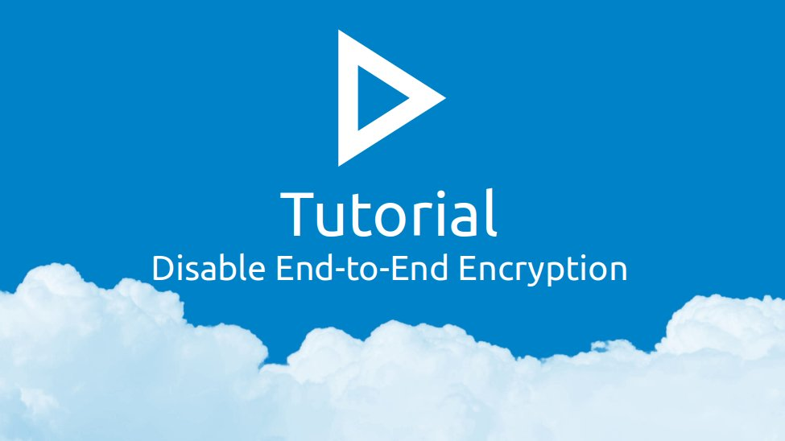

## Прежде, чем вы начнёте
По техническим причинам в Passwords нет встроенного способа отключить сквозное шифрование.
При необходимости, вы можете экспортировать ваши данные, сбросить настройки приложения и импортировать данные без сквозного шифрования.

> :exclamation: Этот процесс удалит все скрытые предметы и все настройки.

1. Убедитесь, что у вас не скрытых предметов; если они есть, [восстановите их](../Settings#recover-hidden-items).
2. Выйдите из всех сторонних клиентов.
3. Попросите администратора создать бэкап.
4. [Экспортируйте базу паролей](./Export#database-backup).
5. Проверьте содержимое экспортированной базы с помощью текстового редактора.
6. Зайдите в [Настройки](web+passlink://goto/settings) -> Опасная зона -> Сбросить все настройки -> Сбросить.
7. [Импортируйте базу паролей](../Import/Import-from-Backup).
8. Удалите бэкап и восстановите настройки.
