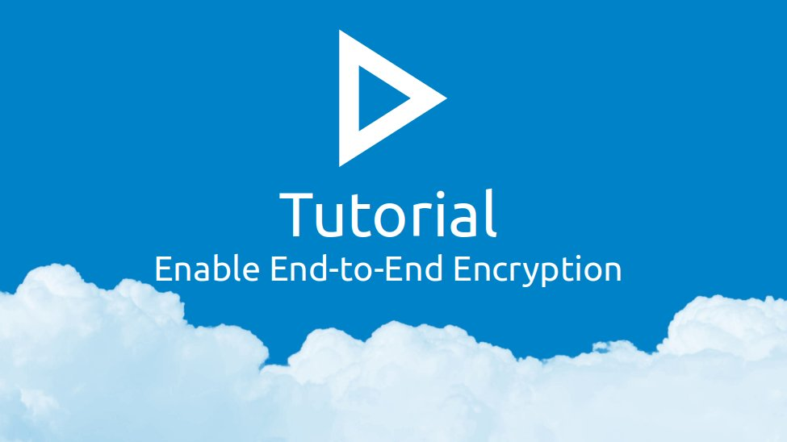

Passwords предлагает усиленное сквозное шифрование, которое требует разблокировки базы паролей с помощью мастер-пароля.

#### Перед тем, как вы начнёте
- По умолчанию, будут зашифрованы все пароли, папки и теги, которые не находятся в общем доступе.
- Все предыдущие ревизии будут удалены.
- Будет создана новая запись с мастер-паролем. Если вы не хотите этого, перейдите в [Настройки](web+passlink://goto/settings) -> включите Экспертные настройки (левый верхний угол), и при включении сквозного шифрования в шаге 5 отключите галочку "Сохранить пароль".
- При настройке сквозного шифрования создаётся копия всех записей - в случае ошибки, потери данных не будет.

#### Включение сквозного шифрования

1. Откройте [настройки](web+passlink://goto/settings).
2. Найдите в разделе "Безопасность" настройку "Сквозное шифрование".
3. Нажмите кнопку "Включить" справа от надписи "Сквозное шифрование".
4. Введите мастер-пароль в диалоговое окно. Мастер-пароль должен быть не менее 12 символов в длину.
   > :warning: Не используйте пароль от профиля Nextcloud.
   > Любое приложение в Nextcloud может прочитать его.
7. Нажмите сохранить.

Все пароли, папки и теги будут автоматически зашифрованы.

> :warning: Не прерывайте процесс шифрования и не перезагружайте страницу
