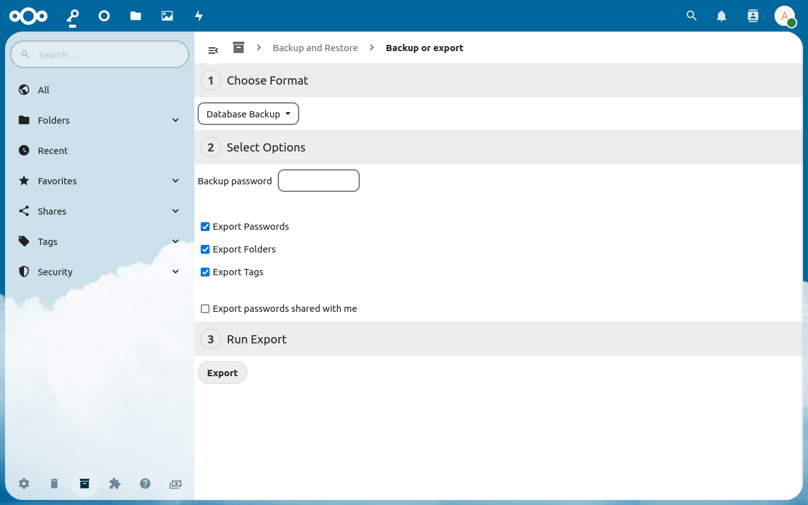

The export can be found `More > Backup and Restore > Backup or Export`.
It can be used to create a backup of your current database or to create csv and office documents for the use in third party applications.

## Creating a custom CSV file

By selecting the export format `Custom CSV`, a customized csv file can be created.
The custom export can only export one database at a time which can be selected by setting the `Database` field to `Passwords`, `Folders` or `Tags`.
Also a custom `Field delimiter` can be selected.
The field delimiter will be used to separate the columns in the csv file.
You can also choose to `Add Header Line` to add a column description in the first line.
If you choose to `Export passwords shared with me`, the export will also contain passwords which were shared with you by other users.

**Note:** Passwords will use the double quote (`"`) as field quote character and escape character. Each field will be wrapped in quotes.

##### CSV Field Mapping
This section allows to define the format of the generated CSV file.
Every field can be added as often as desired, however it should be mentioned that the import only accepts each field once.
