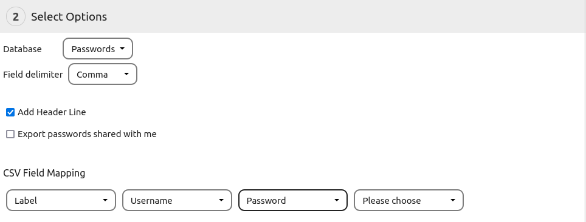

The export can be found under `More > Backup and Restore > Backup or Export`.
It can be used to create a backup of your current database or to create csv and office documents for the use in third party applications.

## Database Backup
The passwords database backup format can be used to save a snapshot of your current database.
It can include all of your `Passwords`, `Folders` and `Tags`.
The backup can be used to restore an earlier state of your database later or to import all your data in another instance of passwords.

**Note:**
- Backups will only contain editable fields of your passwords. Things like the `created` date will not be included.
- Backups use ids to identify objects but these will be different on every instance of passwords.
  This means that if you make a backup on one instance of passwords and import the same backup twice on another instance, every element will be created two times since the ids do not match.
- Backups will not contain hidden passwords, tags or folders

## Predefined CSV Export
This export offers to export `Passwords`, `Folders` and `Tags` using a predefined template for the CSV file.
This makes it easier to import the files since no manual field mapping needs to be used.

The export will create either a CSV file or a ZIP-File containing multiple CSV files for each exported object type.

#### Importing a predefined CSV file
During the import, each file needs to be imported separately using the predefined csv import options.

**Note:** The predefined format may change and export and import should always be made with the same version of the passwords app

## Microsoft Excel / Open Office Calc Export
The office document exports allow the export of the entire database into a single office document.
`Passwords`, `Folders` and `Tags` will be exported as sheets of the document.
The import does not support office documents so you must use the CSV export of your office suite to create an importable file.

## Creating a custom CSV file

By selecting the export format `Custom CSV`, a customized csv file can be created.
The custom export can only export one database at a time which can be selected by setting the `Database` field to `Passwords`, `Folders` or `Tags`.
Also a custom `Field delimiter` can be selected.
The field delimiter will be used to separate the columns in the csv file.
You can also choose to `Add Header Line` to add a column description in the first line.
If you choose to `Export passwords shared with me`, the export will also contain passwords which were shared with you by other users.

**Note:** Passwords will use the double quote (`"`) as field quote character and escape character. Each field will be wrapped in quotes.

##### CSV Field Mapping
This section allows to define the format of the generated CSV file.
Every field can be added as often as desired, however it should be mentioned that the import only accepts each field once.
