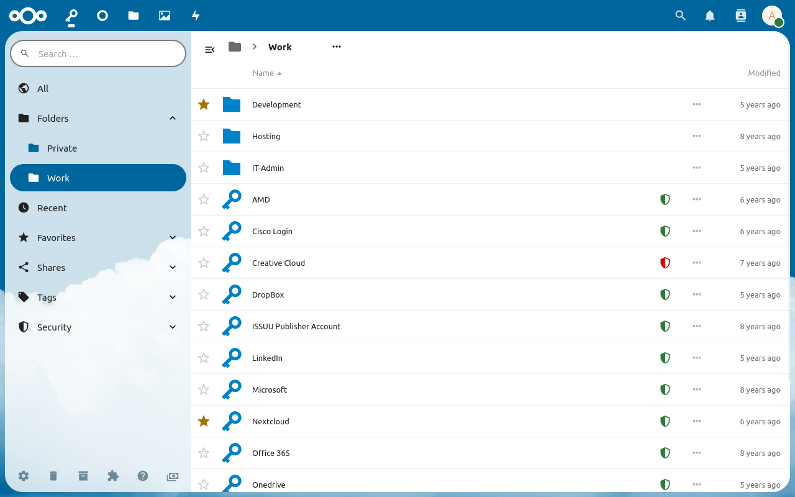

Folders are a great way to organize passwords.
A well structured folder hierarchy makes the application faster and passwords easier to find.
For example you could have a folder "Work" for accounts related to your workplace and a folder "Private" for your own passwords.
A password can only be in one folder at a time.
If you want to classify passwords with multiple keywords, consider using [tags](./Tags).

## Folders in the list view

To open a folder, click on it on the list view.
To move passwords or folders into a folder, drag and drop them onto the folder.
To move passwords or folders into the parent folder, drop them onto the folder in the navigation.

##### The `⋯`-Menu
With the "More" menu, you can access all other options available for the folder.
The "Rename" option will open the "Rename Folder" window where you can change the name.
The "Delete" option will move the folder and its contents to the trash.

## Creating a folder

Click on the `+`-Button in the breadcrumb navigation in the folder section and select "New Folder" to open the folder creation dialog.
Enter the name of the folder and click on "Yes" to create the folder.

**Notes**
- The folder will always be created in the current folder.
- Folders are not unique. Different folders with the same name can exist.

## Deleting folders
Once you select the "Delete" option from the `⋯`-Menu, the folder and all its contents will be moved into the trash.
You can still browse the folder there and restore it if needed.

**Note:** Deleting a folder from the trash will delete the folder and all passwords and folders in it.