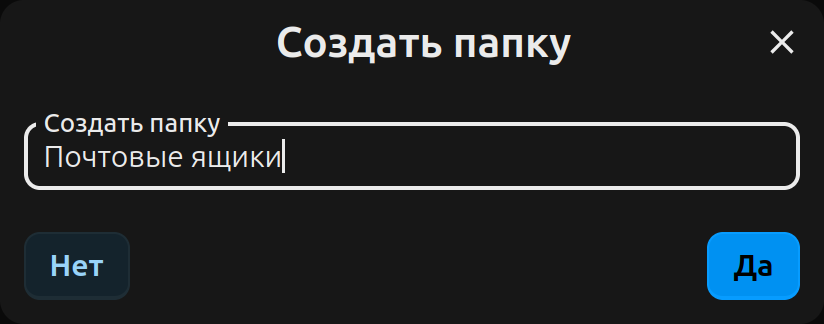

Папки - удобный способ организовать пароли. Хорошая структура папок ускоряет как работу приложения, так и поиск пароля. К примеру, у вас может быть папка "Работа" для аккаунтов, связанных с работой, и папка "Личное" для паролей от личных аккаунтов.
Пароль может быть одновременно только в одной папке.
Если вы хотите организовать пароли по нескольким ключевым словам, возможно вам стоит использовать [теги](./Tags).

## Папки в списке

Для того, чтобы открыть папку, нажмите на неё в списке.
Для того, чтобы переместить в папку пароль или другую папку, перетащите их мышкой в папку.
Для того, чтобы переместить пароль или папку из данной папки, перетащите их мышкой в папку в меню навигации над списком паролей.

#### Меню "Ещё"
В меню "Ещё" (иконка "⋯") вы можете выполнить остальные операции над папкой.

## Создание папки

Для создания новой папки, откройте меню "Ещё" ("⋯") в навигаторе (над списком паролей) и нажмите "Новая папка".
Введите имя новой папки в диалогово окне и нажмите "Да" для завершения.

**Примечания**
- Папка всегда создаётся там, где сейчас открыт список.
- Имена папок не уникальные. Могут существовать несколько папок с одинаковым именем по одному пути.

## Удаление папок
Нажав "Удалить" в меню "Ещё", папка и всё её содержимое будет перемещено в корзину. При необходимости, вы всё ещё можете посмотреть и восстановить её содержимое.

**Примечание:** Удаление папки из корзины навсегда удалит её и все находящиеся в ней пароли и папки.
