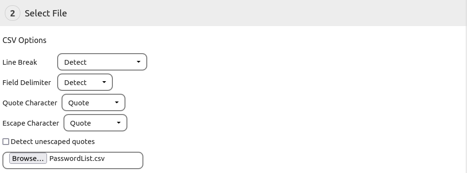

The import can be found `More > Backup and Restore > Restore or Import`.
It can be used to restore a previously made backup, import a backup from another instance or import data from another password manager.

## The Import Steps
##### 1. Choose Format
Choose the format of the file you want to import.
If you want to import a CSV file from an application which is not listed, choose `Custom CSV`.

##### 2. Select File
Select the file you want to import.
If you want to import a custom csv file, make sure to set the csv options before you open the file.

##### 3. Select Options
Select the options for the import.
Depending on the file type, different options may be available which are explained below.

##### 4. Run Import
If you're ready to go, hit the `Import` button and start importing your files

## Import Options
##### Import Mode
The `Import Mode` defines how the Importer should handle conflicts.
`Skip if same revision` will skip entries when an object with the same id and same revision already exists in the database.
`Skip if id exists` will skip entries when the id already exists.
`Overwrite if id exists` will overwrite an entry with the data from the import if the id is found in the database.
`Clone if id exists` will create a new entry if an entry with the same id already exists.
**Note:** For all formats except `Database Backup`, the import will match the passwords by their name.

##### Don't edit passwords shared with me
If this option is selected, passwords which were shared with you by other users will not be overwritten by the import.

## Import specific options and notes
### Database Backup
Database backups are a special import source.

##### Backup password
If the backup has been secured with a password, you will have to enter it here.

### Custom CSV File Options

##### Field Delimiter
Specifies the character used to separate the fields in the csv. The import can try to `Detect` the field delimiter.
Alternatively you can choose one of the options manually.

##### Quote Character
The quote character is used to mark the contents of a field in the csv. Anything after the quote character will be interpreted as content until another quote character is found.

##### Escape Character
This character is used to escape the quote character within a field. If the escape character has to come before the quote character if it appears as part of the content.

##### Detect unescaped quotes
This option can help to parse faulty csv files. It tries to detect whether a quote character is used to signal the beginning or ending of a field or if it is part of the content.

### Custom CSV Import Options

##### Database
Select the database which you want to import your csv into. This also has an effect on the other available options.

##### Skip first line
Skips the first line of the csv. Select this option if your csv file has a header which should not be imported.

##### Interpolate missing fields
If fields like the label or the url are not present, this option will tell the importer to check if another field may contain the value.

##### CSV Field Mapping
Here you can map the columns of your csv file. You don't have to map every column, just the ones you wish to import.
For passwords you will have to map at least the `Password` column, for folders and tags the `Label` column is required.
You can use the `Preview Line` option to preview a different line.

## How to fix faulty CSV files

Some password managers create faulty export files which can not be parsed by the importer.
These files need to be fixed manually in order to work properly.

1. Open the file in a spreadsheet program like [LibreOffice Calc](https://libreoffice.org) or Microsoft Excel.
2. Check the file for errors. Most of these programs do a good job in fixing faulty CSVs. You should make sure that all colums are filled in properly.
3. Export the file as CSV.
4. Try the Import again

##### Example errors

