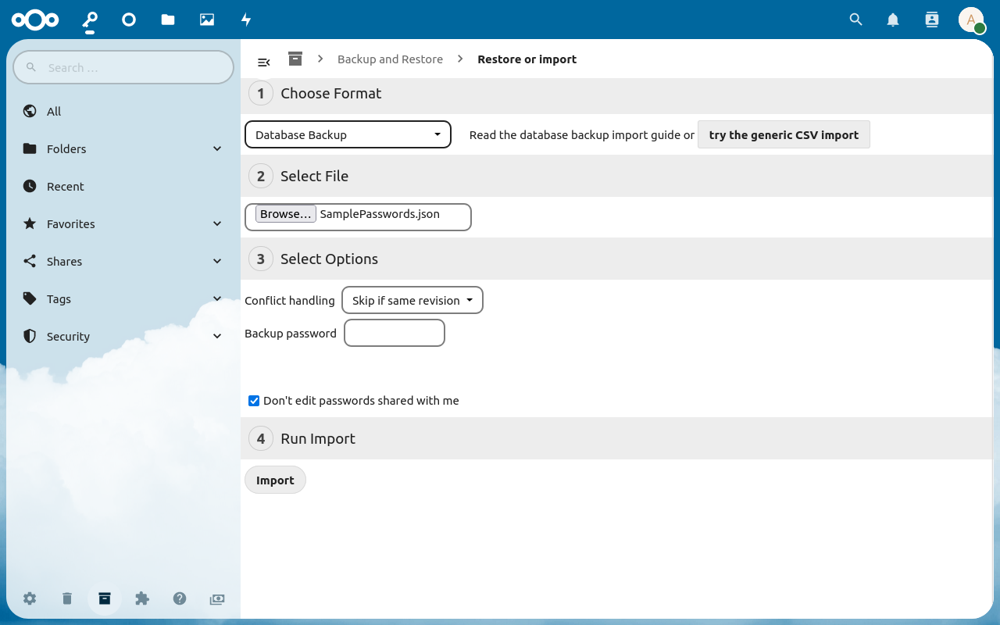

[Импорт паролей](web+passlink://goto/backup/import) находится в разделе "[Архивирование и восстановление]((web+passlink://goto/backup))" в нижнем левом углу.
Импорт паролей можно использовать для восстановления ранее созданного бэкапа или бэкапа с другого сервера, или для импорта паролей из другого менеджера паролей.

## Импорт паролей по шагам
#### 1. Выберите формат
Выберите формат файла, соответствующий приложению, из которого вы импортируете пароли (или "Резервная копия в БД" для бэкапа Passwords).
Если для вашего приложения нет формата файла, выберите опцию "Пользовательский CSV-файл".

#### 2. Выберите файл
Выберите импортируемый файл.
Если вы импортируете пользовательский CSV, укажите соответствующие опции перед тем, как выбирать файл.

### 3. Выберите опции
Выберите опции импорта.
Опции могут отличаться в зависимости от типа файла.
При выборе

### 4. Начните импорт
Если вы готовы, нажмите "Импорт".

## Форматы импорта
Большинство форматов импорта из файла являются импортом из CSV файла с заранее заданными опциями.
Для определённых форматов есть особые опции.
Для таких сервисов есть отдельные инструкции по импорту:
- [Импорт из Passman](./Import/Import-from-Passman)
- [Импорт из Chrome](./Import/Import-from-Chrome)
- [Импорт из резервной копии БД](./Import/Import-from-Backup)
- [Импорт из Enpass](./Import/Import-from-Enpass)
- [Импорт из пользовательского CSV](./Import/Import-from-custom-CSV)

## Опции импорта
### Обработка конфликтов
Режимы обработки конфликтов задают поведение при импорте в случае конфликта.
- "Пропускать совпадающие ревизии" пропускает пароль, если он уже существует и его ревизия совпадает. Работает, только если в импортируемом файле есть поле ревизии.
- "Всегда пропускать" будет пропускать любую запись, которая уже есть в базе данных.
- "Перезапись" будет перезаписывать любую запись, которая уже есть в базе данных.
- "Выполнить слияние" объединит данные из импортируемой записи с существующей записью. Не работает для дополнительных полей.
- "Создать новые" создаст новую запись, даже если такая уже существует.

**Примечание:** если нет поля id, записи будут сравниваться по именам. При импорте из резервной копии всегда используется сравнение по id.

#### Не редактировать предоставленные мне пароли
Если выбрано, предоставленные вам пароли не будут перезаписаны при импорте.

## Решение проблем
### Как исправить проблемный CSV файл

Некоторые менеджеры паролей при экспорте создают проблемные CSV файлы, которые не могут быть распознаны импортёром.
Эти файлы необходимо исправить вручную для правильной работы импорта.

1. Откройте файл в табличном процессоре (Microsoft Excel, LibreOffice Calc или другом).
2. Проверьте файл на ошибки. Обычно табличный процессор автоматически исправляет большинство ошибок. Удостоверьтесь, что столбцы заполнены правильно.
3. Экспортируйте таблицу как CSV файл.
4. Импортируйте новый файл.

##### Пример ошибки в CSV файле

### Не импортируются файлы
Некоторые менеджеры паролей (Passman, Enpass, Bitwarden и другие) позволяют хранить файлы в пароле.
При импорте такого пароля Импортёр покажет сообщение "<Название пароля> содержит прикреплённые файлы, которые невозможно импортировать" для каждого пароля с приложенными файлами.
Passwords не предоставляет файловое хранилище, так как этот функционал уже есть в самом Nextcloud.

Passwords позволяет ссылаться в паролях на файлы из Nextcloud. Поэтому мы рекомендуем вначале скачать файлы из вашего менеджера паролей и разместить их в Nextcloud, затем импортировать пароли и добавить им дополнительное поле с типом "файл", ссылающееся на соответствующий файл в Nextcloud.

**Примечание:** если вы хотите хранить зашифрованные файлы, например, приватные ключи, мы рекомендуем использовать [сквозное шифрование в Nextcloud](https://nextcloud.com/endtoend/).

### Длинные имена дополнительных полей / обрезанные значения
Если у вас есть дополнительные поля с именем длиннее 48 символов, или значения длиннее 320 символов, они будут обрезаны до соответствующей длины.
Дополнительные поля предназначены для обычной для записей информации, типа e-mail адресов или ссылок.
Если вам нужно хранить длинный текст, мы рекомендуем использовать поле "Заметки".

### Несоответствие типа дополнительного поля
Если вы импортируете пароли с дополнительными полями (кроме импорта из резервной копии), их значения проверяются перед импортом.
Поля типа "url" и "email" должны быть в соответствующем формате, иначе они будут преобразованы в тип "текст".
Кроме того, все поля типа "текст" проверяются на их формат - если они содержат url или e-mail адрес, им будет задан соответствующий тип.
