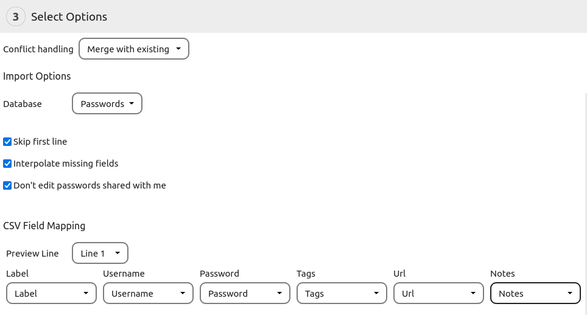

The import can be found under `More > Backup and Restore > Restore or Import`.
It can be used to restore a previously made backup, import a backup from another instance or import data from another password manager.

## The Import Steps
##### 1. Choose Format
Choose the format of the file you want to import.
If you want to import a CSV file from an application which is not listed, choose `Custom CSV`.

##### 2. Select File
Select the file you want to import.
If you want to import a custom csv file, make sure to set the csv options before you open the file.

##### 3. Select Options
Select the options for the import.
Depending on the file type, different options may be available which are explained below.

##### 4. Run Import
If you're ready to go, hit the `Import` button and start importing your files

## Import Options
##### Conflict Handling Mode
The `Conflict handling` mode defines how the Importer should handle conflicts.
`Skip if same revision` will skip an entry if it already exists and the revision matches. Works only if the import contains a revision field.
`Skip always` will skip an entry if it already exists in the database.
`Overwrite existing` will overwrite an entry if it already exists in the database.
`Merge with existing` will merge the new data with the current data. This does not apply for custom fields.
`Create new entry` will always create a new entry, even if it already exists.

**Note:** If no id field is available, entries will be matched by their name. The `Database Backup` option will always use id based matching.

##### Don't edit passwords shared with me
If this option is selected, passwords which were shared with you by other users will not be overwritten by the import.

## Import specific options and notes
### Database Backup
Database backups are a special import source.

##### Backup password
If the backup has been secured with a password, you will have to enter it here.

### Custom CSV File Options

##### Field Delimiter
Specifies the character used to separate the fields in the csv. 
The import can try to `Detect` the field delimiter.
Alternatively you can choose one of the options manually.

##### Quote Character
The quote character is used to mark the contents of a field in the csv. 
Anything after the quote character will be interpreted as content until another quote character is found.

##### Escape Character
This character is used to escape the quote character within a field. 
If the escape character has to come before the quote character if it appears as part of the content.

##### Detect unescaped quotes
This option can help to parse faulty csv files. 
It tries to detect whether a quote character is used to signal the beginning or ending of a field or if it is part of the content.

### Custom CSV Import Options

##### Database
Select what type of data you want to import.
You can choose between `Passwords`, `Folders` and `Tags`.
This option defines which fields you can import and which conversion methods are applied.

##### Skip first line
Skips the first line of the csv.
Select this option if your csv file has a header which should not be imported.

##### Interpolate missing fields
This option will make the Importer try to guess missing fields like the url.

##### CSV Field Mapping
Here you can map the columns of your csv file. 
You don't have to map every column, just the ones you wish to import.
For passwords you will have to map at least the `Password` column, for folders and tags the `Label` column is required.
You can use the `Preview Line` option to preview a different line.

### Enpass JSON

##### Don't import empty fields
Enpass has a lot of default fields which are often left empty.
In order to improve usability, those fields can be skipped during import.

## How to fix faulty CSV files

Some password managers create faulty export files which can not be parsed by the importer.
These files need to be fixed manually in order to work properly.

1. Open the file in a spreadsheet program like [LibreOffice Calc](https://libreoffice.org) or Microsoft Excel.
2. Check the file for errors. Most of these programs do a good job in fixing faulty CSVs. You should make sure that all colums are filled in properly.
3. Export the file as CSV.
4. Try the Import again

##### Example errors

## Compatibility Issues and Workarounds
#### Passman related issues
See the workarounds section in the[Import from Passman](./Import/Import-from-Passman#compatibility-issues-and-workarounds-for-the-passwords-import) tutorial for help regarding the Passman Import/Export.

#### Files can not be imported
Some password managers (e.g. Passman and Enpass) allow files to be stored with passwords.
The Import will show the warning `"Password Name" has files attached which can not be imported.` for each password which has files attached.
The password will be imported anyway but the files will not be imported.
Passwords does not offer any file storage functionality as we believe that it is better to leave this to Nextcloud itself.

Passwords does support the linking of files stored in Nextcloud to passwords.
Therefore we recommend downloading the files manually from your old Password manager and storing them in Nextcloud.
After this you can edit the password and add a custom field with the type "file" and choose the file from the file dialog.

**Note:** If you want to store secret files like private keys, we recommend that you use the [Nextcloud E2E Encryption](https://nextcloud.com/endtoend/).

#### Long custom field names / values are truncated
If you have custom fields with a label that exceeds 48 characters or a value that exceeds 320 characters, it will be truncated to fit the length limitations of Passwords.
Custom fields are intended to contain usual password related information like and e-mail address or the like.
They are not intended to hold large amounts of data.
If you want to store long texts, we recommend to use the "Notes" field.
