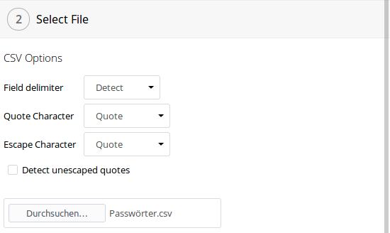
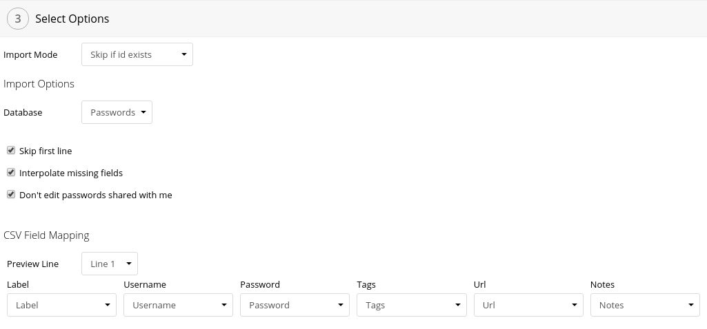

Опция "Пользовательский CSV-файл" позволяет импортировать из любого CSV файла.
Используйте её для файлов, созданных вручную, или экспортированных из сервиса, импорт из которого не поддерживается официально.

## Опции файла


#### Разрыв строки
Определяет, какой символ (или символы) являются разрывом строки в данном файле.
Опция `Распознать автоматически` проверяет распространённые варианты и выбирает подходящий.
Если в файле используются разные символы разрыва строк, рекомендуется указать эту опцию вручную.

#### Разделитель поля
Указывает, какой символ разделяет поля в строке.
Опция `Распознать автоматически` проверяет распространённые варианты и выбирает подходящий.

#### Символ кавычки
Всё между символами кавычек считается содержимым поля.

#### Эскейп-символ
Этот символ стоит перед кавычкой, чтобы она считалась частью значения поля.

#### Распознать неэкранированные кавычки
Эта опция пытается автоматически определить, является ли кавычка частью значения или нет.

## Опции импорта


> :star: Этот раздел относится только к опциям, специфичным для импорта из пользовательского CSV файла.
> Для остальных опций импорта смотрите [соответствующий раздел документации импорта](../Import#опции-импорта).

### База данных
В какую базу данных импортируются записи.
Выбирается между `Пароли`, `Папки` и `Теги`.
От этой опции зависит, как применятся метод обработки конфликтов, и какие поля используются в маппинге.

### Пропустить первую строчку
Обычно, первая строка в CSV файлах является заголовком.
Данная опция позволяет пропустить первую строчку.

### Интерполировать отсутствующие поля
Если эта опция указана, импортёр попытается угадать значения отсутствующих полей.

## CSV Field Mapping
Here you can map the columns of your csv file.
You don't have to map every column, just the ones you wish to import.
For passwords you will have to map at least the `Password` column, for folders and tags the `Label` column is required.
You can use the `Preview Line` option to preview a different line.

### Custom Fields format
To import custom fields from a CSV file, the type of the column must be set to "Custom Fields" and the formatting must be as shown below.
Each line contains one custom field.
First, there is the label of the field which is optionally followed by a comma and the type of the field.
After that is a colon and then the value of the field.
The type can be one of `text`, `email`, `url`, `secret`, `file` or `data`.

```
Label,type:value
E-Mail,email:email@example.com
Url,url:https://www.example.com
Text,text:some sample text
Password,secret:secret password
File,file:/path/of/file/on/your/webdav.fil
Data,data:applicationdatafield
```

## Troubleshooting
See [import troubleshooting](../Import#Troubleshooting).
