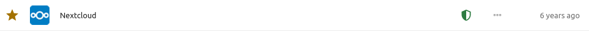

## Пароль в списке

Список паролей даёт быстрый доступ к часто используемой информации.
Вы можете видеть фавикон веб-сайта и имя пароля, а также статус безопасности, обозначаемый иконкой щита. Рядом с ним находится дата последнего изменения. В зависимости от ваших настроек, в списке также может показываться дополнительная информация

##### Копирование пароля и имени
Одиночное нажатие на запись в списке скопирует пароль, двойное - имя пользователя.
Если действие было успешным, сверху слева появится уведомление.

##### Статус безопасности
Иконка щита справа от пароля символизирует статус безопасности.
- Если иконка зелёная, пароль безопасен.
- Если иконка жёлтая, пароль не соответствует одному из правил безопасности. Наведите курсор мыши на иконку, чтобы узнать, какое из правил было нарушено. В случае наличия дубликата (сообщение "Уже есть"), нажмите на иконку, чтобы посмотреть, в каких записях совпадает пароль (смотрите "[F.A.Q. - Пароль помечен как дубликат, как найти другой пароль?](F.A.Q.md/#пароль-помечен-как-дубликат-как-найти-другой-пароль)")
- Если иконка красная, пароль был обнаружен в базе данных украденных паролей.
Вы можете отфильтровать пароли по их статусу в разделе "Безопасность".

#### Меню "Ещё"
В меню "Ещё" (кнопка "⋯" в списке паролей), вы можете использовать остальные опции, доступные для паролей.

Кнопка "Детали" открывает справа меню с [деталями](./Passwords/Password-Detail-View) о пароле, а также [общим доступом](./Passwords/Sharing-Passwords), заметками и предыдущими версиями. Кнопка "Общий доступ" открывает это же меню на вкладке "Общий доступ".

Кнопка "Редактировать" открывает [меню для редактирования пароля](./Passwords/Creating-Passwords) и его свойств.

Кнопка "Откройте страницу изменения пароля" откроет окно, в котором можно будет изменить пароль на веб-сайте (Данная функция доступна не для всех сайтов).

Кнопка "Показать QrCode" покажет QR-код с логином, паролем, ссылкой на веб-сайт или хешем SHA1 пароля.

#### Дополнительная отображаемая информация
Если в настройка [включено отображение тэгов](./Settings#show-tags-in-the-list-view), в списке паролей вы увидите теги для каждого пароля.

Вы также можете настроить,
- [какое поле используется в качестве названия](./Settings#set-title-from);
- что делать при [одинарном](./Settings#single-click-action-advanced) или [двойном](./Settings#double-click-action-advanced) нажатии;
- [показывать ли имя пользователя после названия записи](./Settings#show-username-in-list-view-advanced).
