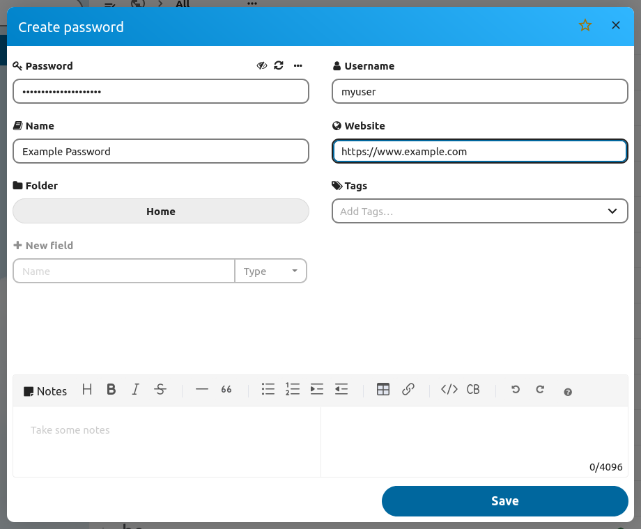

### Properties
##### Username
The username of the account. The username is optional.

##### Password
The password. You can toggle the visibility by clicking the "👁"-icon.
The refresh ("🔃") button will generate a new password and also show the password options.

##### Name
The name of the password entry which will be shown in the list view.
If no name is chosen one will be generated.

##### Website
The website associated with the password.
The website will be used by the browser extension to determine on which pages the password will be suggested.

### Notes
You can take notes for your password which will be shown in a separate "Notes" tab in the password details.
The notes can be up to 4096 characters long and can be styled using the [Markdown syntax](./Markdown-Notes).

### Custom Fields
You can create up to 20 custom fields for every password.
Each field can have a name with up to 48 characters.
The value of a custom field can be up to 320 characters long.
Custom fields have a specific type attribute which determines how the field is shown and how apps and extensions use it.

There can be special data fields which are created by apps.
You can show those fields by enabling the [option](../Settings#show-hidden-custom-fields-Advanced) in the advanced settings.

##### Custom Field Types

| Type | Description |
| --- | --- |
| Text | A regular text field |
| Secret | A password field. These fields are not monitored by the password security check |
| Email | An email field |
| Website | An url field. These fields are also used by the browser extension to create recommendations |
| File | A reference to a file stored in Nextcloud |
| Data | A field with technical data from apps & extensions. Usually hidden unless the setting is activated |

### More Options
##### Favorite
Select this box to mark the password as favorite

##### Encryption
If available, you can select an encryption type for the password here.

### Tags
It is currently not possible to assign tags in the password creation dialog.
To assign tags to a password, please use the `Add Tags...` area in the password detail view.