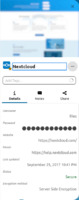

## Details

In the "Details"-Tab, you will find all the fields that are filled for the password.
If you have created custom fields, they will be shown here as well.
You can copy the value of any text or password field by clicking on it.
Link and file fields will open a new tab with the url if clicked.
Email fields will open your mail application if clicked.

#### Technical details
The technical details option found at the bottom of the details section will reveal additional details about the password entry if checked.

##### The Statistics Section
You can also find technical data about your password in the detail view.
You can see when it was created, when the password itself was last changed, how often it was shared and how many revisions there are of it.

##### The Security Section
The security section shows all security related information.

###### Password Encryption Type Explained
See [encryption types](./Encryption/Encryption-Types).

###### Password Security Status Explained
See [encryption types](./Password-Security-Status).

## Notes

The "Notes"-Tab will only be shown if you have notes for the password.
Notes can contain some markdown and can be up to 4096 characters long.

## Share

If sharing is allowed for this password, you can share it to other users from this tab.
You can also see who shared the password with you and which permissions you have. 
(If the password was shared with you)

For more details about password sharing, read [Sharing Passwords](./Sharing-Passwords).

## Revisions

Every time something about a password is changed, a new revision is created.
Each revision stores the complete password data.
Revisions can be seen revisions as the history of your password.
Revisions are immutable and can not be changed or deleted.
To view the details of a revision, simply click on the revision.
To restore a revision, click on the `⟲`-icon on the right.

## Action Menu
The action menu can be found on the right side under the website preview or in the top right corner if no website preview is shown.
It provides access to common tasks like editing, moving, cloning or deleting the password.

##### QR Code
The QR-Code tab allows you to transfer commonly used properties like the password, username or website simply by scanning a qr-code.
It makes it easy for example if you are setting up a new mobile device and don't want to type your (hopefully) long and complex password all by yourself.

##### Print password
If the [`print option`](../Settings#show-print-option-expert-settings) is enabled, you can open the print dialog from the menu.