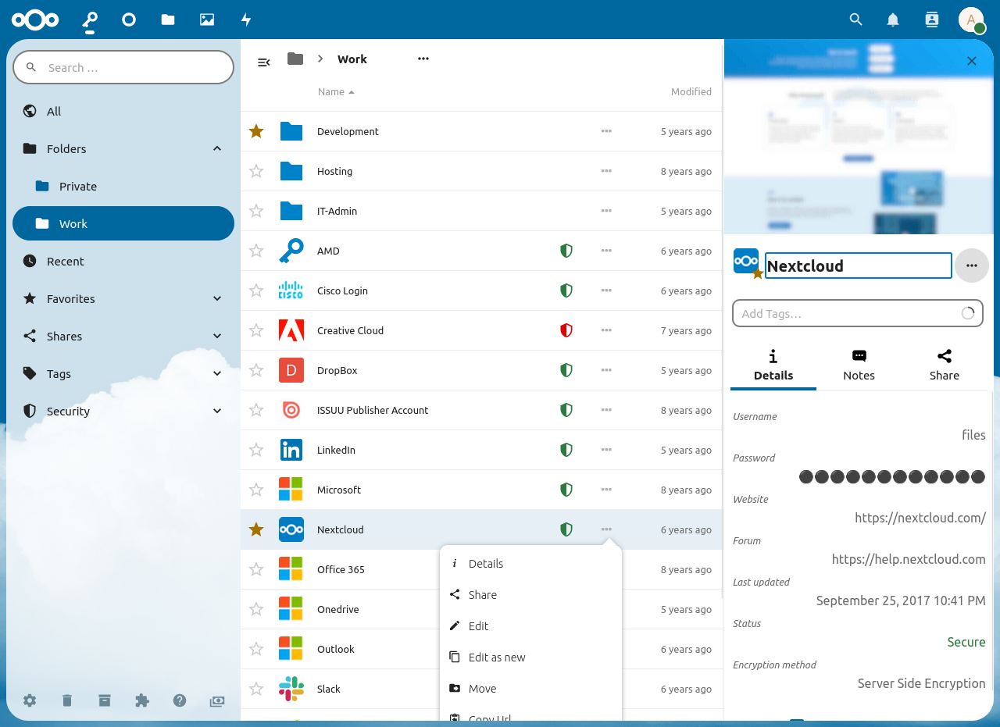
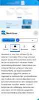
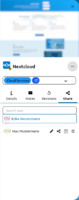

## Детали

Во вкладке "Детали", вы найдёте все заполненные поля (кроме заметок) у пароля. Если вы создали дополнительные поля, они также отобразятся здесь.
При нажатии на ссылку или файл, они откроются в новой вкладке.
Поля Email откроют ваше почтовое приложение по умолчанию.

#### Технические детали
Галочка "Технические детали" внизу меню при включении показывает дополнительную информацию о записи.

##### Статистика
В разделе "Статистика" находятся дата создания, последняя дата обновления, id, папка, в которой находится пароль, количество версий (ревизий) и количество пользователей, которым был предоставлен доступ к паролю.

##### Безопасность
В раздел "Безопасность" находится [статус безопасности](./Password-Security-Status) пароля и информация о [шифровании](./Encryption/Encryption-Types), а также хеш SHA-1 пароля.

## Заметки

Вкладка "Заметки" показывается, только если в записи они есть. Заметки содержат текст в [формате Markdown](./Markdown-Notes.md) и могут быть длиной до 4096 символов.

## Общий доступ

Здесь вы можете поделится данным паролем (если вам это разрешено).
Вы также можете здесь увидеть, кому вы предоставили доступ, и, если это чужой пароль, кто его предоставил вам.

Для дополнительной информации смотрите "[Общий доступ](./Sharing-Passwords)".

## Ревизии

При каждом изменении пароля создаётся новая ревизия.
Каждая ревизия хранит все данные о пароле.
Во вкладке "Ревизии" можно увидеть все ревизии данного пароля.
Ревизии нельзя изменить или удалить.

Для того, чтобы посмотреть информацию о ревизии, нажмите на неё.
Для восстановления ревизии, нажмите на иконку восстановления `⟲`.

## Меню действий
Меню действий находится в правом верхнем углу (под предпросмотром сайта, если он есть). Оно предоставляет доступ к стандартным действиям, таким как изменение, перемещение, копирование или удаление.

#### QR-код
Кнопка "Показать QrCode" открывает диалоговое окно, в котором показывается QR-код выбираемого свойства - логина, пароля, ссылки или хеша SHA-1 пароля.

#### Печать пароля
Если в настройках [включена возможность печать пароль](../Settings#show-print-option-expert-settings), этой кнопкой вызывается диалог печати.
