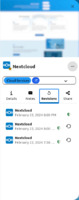

## Details

In the "Details"-Tab, you will find all the fields that are filled for the password.
If you have created custom fields, they will be shown here as well.
You can copy the value of any text or password field by clicking on it.
Link and file fields will open a new tab with the url if clicked.
Email fields will open your mail application if clicked.

##### The Statistics Section
You can also find technical data about your password in the detail view.
You can see when it was created, when the password itself was last changed, how often it was shared and how many revisions there are of it.

##### The Security Section
The security section shows all security related information.

###### Password Encryption Type Explained
- `Server-side encryption` / `Server-side encryption (Gen. 1)` means that the password is sent to the server in plain text and then stored encrypted on the server.
  Your server administrator or anyone with access to the database could gain access to this password.
- `Server-side encryption (Gen. 2)` means that the password is sent to the server in plain text and then stored encrypted on the server with a key that is stored separately.
  Your server administrator or anyone with access to the server and the database could gain access to this password.
- `Client-side encryption` means that the password is encrypted before it is sent to the server with a key that is encrypted with a password that only you know.
  It is only possible to gain access to your data by knowing your master password.

###### Password Security Status Explained
- `Secure` (green) means that the password is perfectly safe
- `Weak (Duplicate)` (yellow) means that you are using this password more than once.
  You need to activate [`Mark duplicates`](../Settings#mark-duplicates) in the settings for this.
- `Weak (Outdated)` (yellow) means that the password has reached its maximum age.
  You need to activate [`Maximum age in days`](../Settings#maximum-age-in-days) in the setting for this.
- `Broken` (red) means that the password is bad and can be found in hacker databases on the internet.
  You need to change it and you should make sure that the account you're using it for has not been compromised

## Notes

The "Notes"-Tab will only be shown if you have notes for the password.
Notes can contain some markdown and can be up to 4096 characters long.

## Share

##### Share
If sharing is allowed for this password, you can share it to other users from this tab.
You can also see who shared the password with you and which permissions you have. 
(If the password was shared with you)

For more details about password sharing, read [Sharing Passwords](./Sharing-Passwords). 

##### QR Code
The QR-Code tab allows you to transfer commonly used properties like the password, username or website simply by scanning a qr-code.
It makes it easy for example if you are setting up a new mobile device and don't want to type your (hopefully) long an complex password all by yourself.

## Revisions

Every time something about a password is changed, a new revision is created.
Each revision stores the complete password data.
Revisions can be seen revisions as the history of your password.
Revisions are immutable and can not be changed or deleted.
To view the details of a revision, simply click on the revision.
To restore a revision, click on the `⟲`-icon on the right.