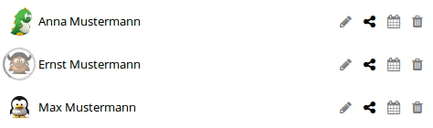

Passwords allows you to share a password with other user from your Nextcloud instance.
To share a password. click on the `⋯`-menu and then click `Details`.
The sharing options can be found in the `Share` tab.

**Note:** The administrator of your Nextcloud instance may disable sharing.
If someone shares a password with you, he can also disable sharing.

## Share passwords with another user
To share the password with another user, simply type the name or the username of the person in the search field.
You can then select the user from the search results.
If the user does not appear in the search results it is likely that it does not exist or you are not allowed to share with him.

#### Write permissions
By clicking on the `✎`-icon you can allow a user to change the password.
The icon will be light grey if the user can not edit the password and full black if he can.

#### Sharing permissions
By clicking on the `Share`-icon you can allow a user to share the password with other users.
The icon will be light grey if the user can not share the password and full black if he can.

#### Expiration date
By clicking on the `🗓`-icon, you can open the expiration date dialog.
You can now set an expiration date via the date field in the dialog.
On this date, the share will automatically be deleted.
If you clear the date field and confirm the dialog, any existing expiration date will be removed.
The icon will be full black if an expiration date is set.
By hovering over the icon, you can see the date.

#### Unshare a password
By clicking on the `🗑`-icon, the password will be no longer shared with the user.

#### Updating shared passwords
Passwords are released by creating a copy of the password in the account of the user with whom the password was shared.
By doing so, the receiver of the shared password can access the passwords without having access to your password library.
This also means that if a shared password is updated or the permissions of the share are changed, these changes need to be synchronized.
Since this synchronisation is done by the server in the background, it may take some minutes.
To make this process transparent to you, you will see a loading icon around the avatar of the user if there are changes pending for or from this specific user.

