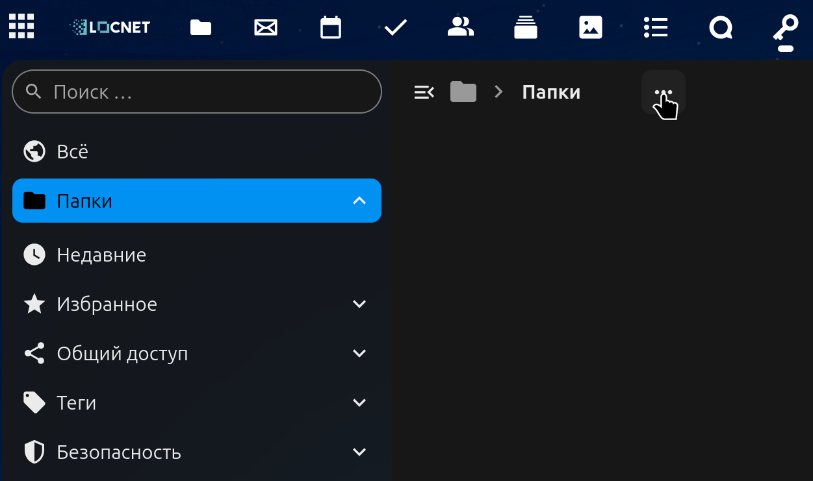
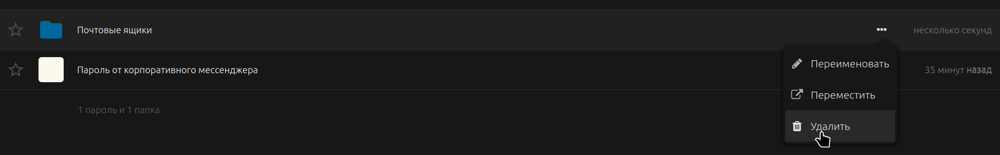
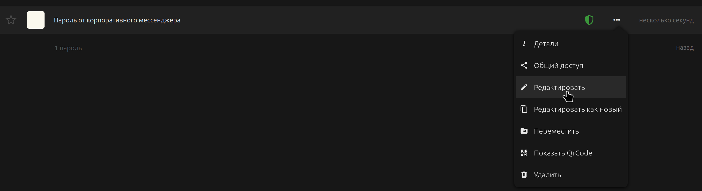
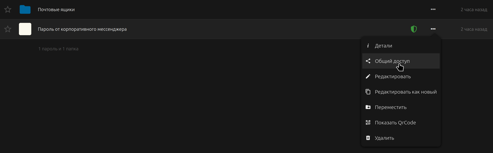
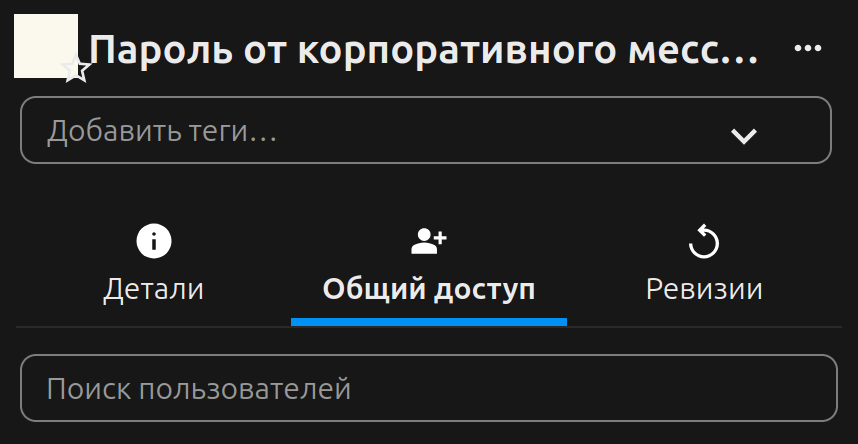
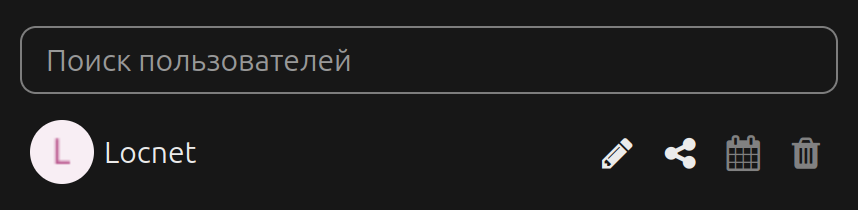
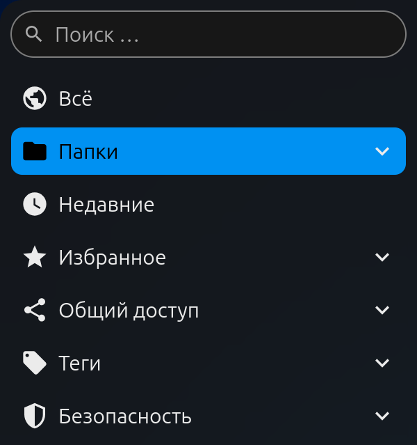

> :star: Эта страница кратко описывает основной функционал Passwords

# Папки
[Подробное руководство](./Folders)

Папки позволяют организовывать структуру хранения паролей.
Каждый пароль находится в одной папке.
Для аналога ключевых слов смотрите [**теги**](#теги).

## Создание папок
### Создание папки в корне
1. Откройте раздел "Папки".
2. Откройте меню "Ещё" в навигаторе (⋯).

3. Нажмите "Создать папку".
4. Введите имя новой папки.

5. Нажмите "Да", чтобы сохранить папку.

### Создание папок в других папках
1. Откройте раздел "Папки".
2. Найдите необходимую папку.
3. Повторите действия с шага 2 при [создании папки в корне](#создание-папки-в-корне).

## Удаление папок
1. Найдите папку в разделе "Папки".
2. Откройте меню "Ещё" -> кнопка "Удалить".

3. При необходимости удалите папку из корзины.

> :warning: При удалении папки удаляются все пароли; после удаления из корзины, восстановить её и пароли невозможно.

# Пароли
[Подробное руководство](./Passwords)

Все пароли в Passwords хранятся в записях, которые также могут содержать относящуюся к паролю информацию, например, логин и ссылку на веб-сайт.
Пароль находится в одной из [**папок**](#папки) и может содержать один или несколько [**тегов**](#теги).

## Создание паролей
[Подробное руководство](./Passwords/Creating-Passwords.md)

1. Откройте раздел "Всё" или зайдите в раздел "Папки" и найдите папку, в которой вы хотите создать пароль.
2. Откройте меню "Ещё" в навигаторе (⋯).

3. Нажмите "Новый пароль".
4. Заполните поля в диалоговом окне.

    Пароль можно скрыть и показать, нажав на иконку глаза 👁.
    Кнопка 🔃 генерирует новый пароль.
    Меню "Ещё" (кнопка `⋯`) позволяет выбрать параметры генерируемого пароля.

    К записи можно добавлять несколько тегов.
    Запись можно добавить в избранные, нажав на звезду в правом верхнем углу; избранные пароли видно в отдельном разделе "Избранное"
    Папку можно выбрать в диалоговом окне, нажав на поле "Папка".

    Поле "Заметки" позволяет писать текст в [формате Markdown](./Passwords/Markdown-Notes.md).
5. Нажмите кнопку "Сохранить" для завершения, или крестик в правом верхнем углу для отмены.

## Редактирование паролей
1. Найдите пароль в списке "Всё" или в его папке.
2. Откройте меню "Ещё" (кнопка `⋯` справа у пароля в списке).
3. Нажмите кнопку "Редактировать".

4. Внесите необходимые изменения в диалоговом окне.

5. Нажмите кнопку "Сохранить" для завершения, или крестик в правом верхнем углу для отмены.

## Удаление паролей
1. Найдите пароль в поиске, разделе "Все" или в папке.
2. Откройте меню "Ещё" -> кнопка "Удалить".

3. При необходимости удалите пароль из корзины.

> :warning: После удаления из корзины восстановить пароль невозможно.

## [Общий доступ]
[Подробное руководство](./Passwords/Sharing-Passwords.md)

К паролям можно предоставлять общий доступ - другой человек увидит данный пароль (но не другие пароли из вашего хранилища), а также (при наличии соответствующего разрешения) сможет его редактировать его (но не удалить) и/или предоставлять к нему доступ другим пользователям.

### Предоставление доступа к паролю
1. Найдите пароль в поиске, разделе "Все" или в папке.
2. Откройте меню "Ещё" -> кнопка "Общий доступ".

3. Введите имя пользователя в поле "Поиск пользователей".

4. Выберите пользователя из выпадающего списка, или если имя введено полностью, нажмите Enter.
5. Укажите права для получателя.

    Для изменения нажмите на иконку:
    - Иконка карандаша `✎` - разрешение на редактирование.
    Белая иконка - разрешено, серая - запрещено.
    - Иконка доступа `⠪` - разрешение предоставлять доступ.
    Позволяет человеку передавать доступ к этому паролю.
    Белая иконка - разрешено, серая - запрещено.
    - Иконка календаря `🗓` - финальная дата. Если задана (белая иконка), в указанный день права будут отозваны.
    - Иконка корзины `🗑` - отозвать права.

> :warning: При копировании или переносе общего пароля синхронизация прекращается.

### Отзыв доступа к паролю
1. Откройте меню общего доступа (см. шаги 1-2 в "[Предоставление доступа к паролю](#предоставление-доступа-к-паролю)")
2. Нажмите на иконку корзины `🗑` напротив тех пользователей, у которых вы хотите отозвать доступ к паролю.

> :warning: Отзыв доступа **не гарантирует**, что у другого человека нет личной копии пароля в его хранилище или где-либо вне приложения Passwords.

# Теги
[Подробное руководство](./Tags.md)

Теги являются одним из способов организации хранения паролей и подобны ключевым словам - Passwords позволяет быстро получить список всех паролей с определённым тегом.

## Создание тегов
### При создании/редактировании паролей
В меню редактирования пароля введите имя тега в поле "Теги" и нажмите Enter.

### В списке тегов
1. Откройте раздел "Теги".
2. Откройте меню "Ещё" в навигаторе (⋯).

3. Нажмите кнопку "Создать тег".
4. Введите имя тега и выберите его цвет, нажав на поле с цветом, или выберите случайный цвет, нажав на кнопку 🔃 справа.

5. Нажмите "Да", чтобы сохранить тег.

## Удаление тегов
1. Найдите тег в разделе "Теги".
2. Откройте меню "Ещё" -> кнопка "Удалить".

3. При необходимости удалите тег из корзины.

> :warning: После удаления из корзины восстановить тег невозможно.

> :star: При удалении тегов пароли **не** удаляются.

# Поиск
[Подробное руководство](./Search)

Passwords позволяет искать пароли по их названию или содержимому, а также искать папки или теги по их названию.

## Поиск по списку
Для поиска паролей и папок в видимом на данный момент списке, введите искомую строку в поле поиска.
При включенной опции "Живой поиск", поиск автоматически включается при наборе текста.

## Глобальный поиск
Глобальный поиск ищет по всем паролям, папкам и тегам.
Глобальный поиск включается нажатием Enter в поле поиска, или переходом в раздел Поиск ([по умолчанию выключен](Settings##search-everywhere-with-enter-advanced)).
