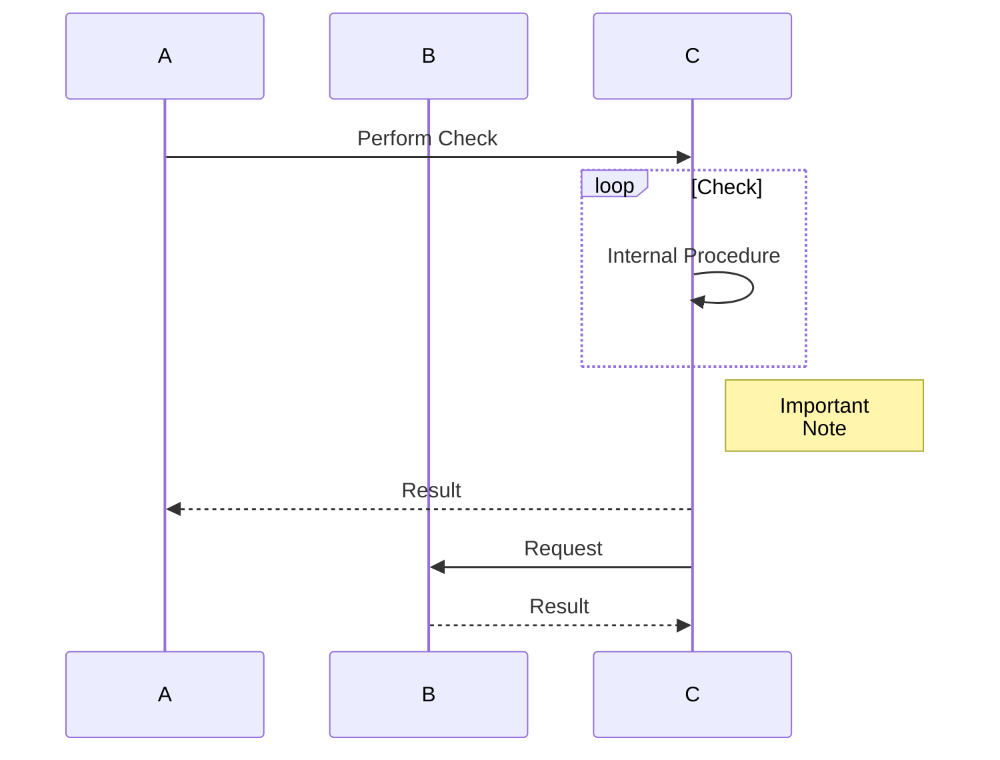

# Quotes and Notices
> Blockquote

> :star: Information

> :thumbsup: Recommendation

> :warning: Warning

> :exclamation: Important

* List Item
  > Blockquote
* List Item
  > :star: Information
* List Item
  > :thumbsup: Recommendation
* List Item
  > :warning: Warning
* List Item
  > :exclamation: Important


# Headlines
# H1
## H2
### H3
#### H4
##### H5
###### H6

###### He@dl!n€ with' $pecial&?% characters<|>


# Links
* [external link](https://example.com)
* [#anchor link](#h1)
* [page link](Settings)
* [page #anchor link](Settings#advanced-settings)


# Lists
#### Ordered List
1. Item 1
    1. Item 1
        1. Item 1
        2. Item 2
        3. Item 3
        4. Item 4
        5. Item 5
    2. Item 2
    3. Item 3
    4. Item 4
    5. Item 5
2. Item 2
    * Item 1
    * Item 2
    * Item 3
    * Item 4
    * Item 5
3. Item 3
    - Item 1
    - Item 2
    - Item 3
    - Item 4
    - Item 5
4. Item 4
5. Item 5


#### Unordered List Type 1
* Item 1
    * Item 1
        * Item 1
        * Item 2
        * Item 3
        * Item 4
        * Item 5
    * Item 2
    * Item 3
    * Item 4
    * Item 5
* Item 2
    1. Item 1
    2. Item 2
    3. Item 3
    4. Item 4
    5. Item 5
* Item 3
    - Item 1
    - Item 2
    - Item 3
    - Item 4
    - Item 5
* Item 4
* Item 5


#### Unordered List Type 2
- Item 1
    - Item 1
        - Item 1
        - Item 2
        - Item 3
        - Item 4
        - Item 5
    - Item 2
    - Item 3
    - Item 4
    - Item 5
- Item 2
    1. Item 1
    2. Item 2
    3. Item 3
    4. Item 4
    5. Item 5
- Item 3
    * Item 1
    * Item 2
    * Item 3
    * Item 4
    * Item 5
- Item 4
- Item 5


# Tables
| TH1 | TH2 | TH3 |
| --- | --- | --- |
| TD1 | TD2 | TD3 |
| TD4 | TD5 | TD6 |
| TD7 | TD8 | TD9 |

# Code
```
Standard code block type 1
```

~~~
Standard code block type 2
~~~


```bash
Bash code block
```

Text `Code`.


# Formatting
* **Bold 1**
* __Bold 2__
* _Italic 1_
* *Italic 2*
* ~~Striketrough~~

# Images
[](./_files/main-section.png)

[](../_files/Gallery/feature-overview.mp4)


# Diagrams

