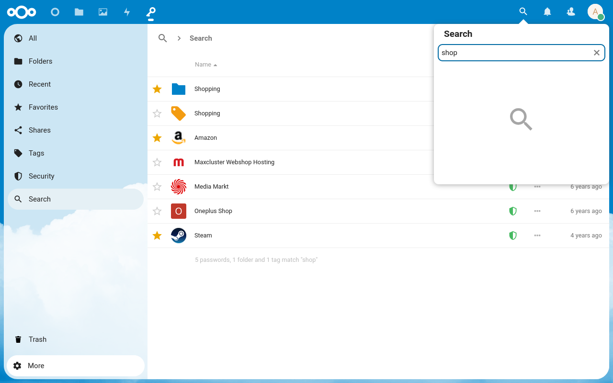
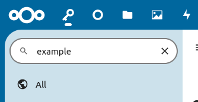

## Поиск по странице
Если в данном разделе включен поиск, над списком разделов будет находится поисковая строка.
С помощью неё можно искать по открытому разделу.
Нажатие на иконку "X" отчистит поле поиска.

При включенной опции "[Живой поиск](Settings##search-as-i-type-advanced)", поиск по странице будет автоматически включен, как только вы начнёте набирать текст.

## Поиск везде
По умолчанию поиск происходит только среди видимых на данный момент паролей, папок и тегов.
В разделе "Поиск" можно искать одновременно по всем паролям, папкам и тегам.
Если у вас включена опция "[Искать везде по клавише Enter](Settings##search-everywhere-with-enter-advanced)", нажатие на Enter при обычном поиске автоматически переключит вас на глобальный поиск.

## Расширенный поиск
По умолчанию, поиск ищет по названию, логину, URL и заметкам в пароле.
Вы можете использовать расширенный синтаксис `поле:значение` для поиска по другим полям.
Если в значении есть пробелы, оно должно быть заключено в кавычки: `поле:"значение с пробелами"`.
Можно указывать несколько полей вместе с обычным поиском:
`поле1:значение1 поле2:"значение 2" обычный поиск`.

**Примечание:** Чтобы пароль попал в результат, должны совпасть все поля.

### Допустимые поля:

| Object | Fields                                                                                                                                                           |
| ------ | ---------------------------------------------------------------------------------------------------------------------------------------------------------------- |
| Пароль | `website`, `username`, `url`, `type`, `password`, `notes`, `label`, `id`, `revision`, `edited`, `status`, `statusCode`, `hash`, `favorite`, `sseType`, `cseType` |
| Папка  | `label`, `type`, `id`, `revision`, `edited`, `sseType`, `cseType`                                                                                                |
| Тег    | `label`, `type`, `id`, `revision`, `edited`, `sseType`, `cseType`                                                                                                |

### Альтернативные названия:

| Имя         | Поле                                           |
| ----------- | ---------------------------------------------- |
| `name`      | `label`                                        |
| `title`     | `label`                                        |
| `user`      | `username`                                     |
| `colour`    | `color`                                        |
| `favourite` | `favorite`                                     |
| `sse`       | `sseType`                                      |
| `cse`       | `cseType`                                      |
| `sha`       | `hash`                                         |
| `all`       | `website`, `username`, `url`, `notes`, `label` |
