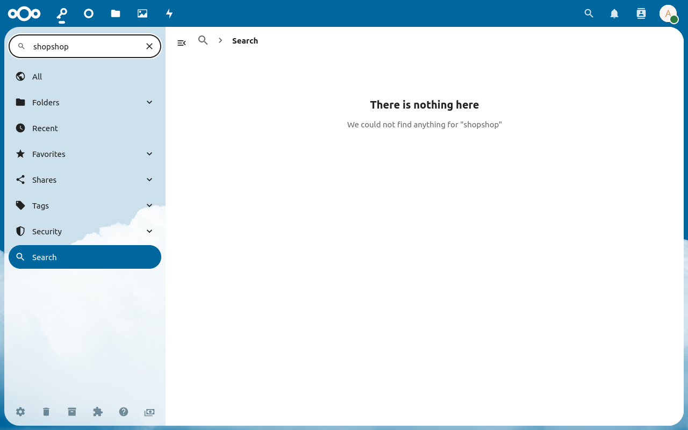

The search section will appear when a global search is triggered.
You can search all passwords, folders and tags from the search section.

## Search in page
If the search is available in the current section, the search box in the app navigation on the left will be enabled.
The search will automatically show all entries matching the current search query.
Clicking the "X" icon in the search box will clear the search query and show all entries again.

You can also open the search box with `Ctrl` + `F` or by typing anywhere on the page if [the "Search as i type" option](Settings##search-as-i-type-advanced) is activated.

## Search everywhere
By default, you will only search in the currently displayed passwords, folders and tags.
But you can also use the global search to search in all passwords, folders and tags.
To do so, you have to click on the "Search everywhere for "…"" link which you can find either at the end of the current search results or below the "No results" message.
If you have [the "Search everywhere with Enter" option](Settings##search-everywhere-with-enter-advanced) option enabled, you can also trigger the global search by hitting the `Enter` key in the search box.

## Advanced search usage
By default, the search will search the url, username, name and notes of a password.
You can use an advanced syntax to search other fields as well.
The advanced syntax consists of a field and a value like this `field:value` or this `field:"value with spaces"`.
You can use multiple fields: `field1:value1 field2:value2 rest of the query`.

**Note:** All fields must match for each result.

##### Available Fields

| Object    | Fields                                                                                                                                                           |
|-----------|------------------------------------------------------------------------------------------------------------------------------------------------------------------|
| Passwords | `website`, `username`, `url`, `type`, `password`, `notes`, `label`, `id`, `revision`, `edited`, `status`, `statusCode`, `hash`, `favorite`, `sseType`, `cseType` |
| Folders   | `label`, `type`, `id`, `revision`, `edited`, `sseType`, `cseType`                                                                                                |
| Tags      | `label`, `type`, `id`, `revision`, `edited`, `sseType`, `cseType`                                                                                                |

##### Alias names

| Alias       | Field                                          |
|-------------|------------------------------------------------|
| `name`      | `label`                                        |
| `title`     | `label`                                        |
| `user`      | `username`                                     |
| `colour`    | `color`                                        |
| `favourite` | `favorite`                                     |
| `sse`       | `sseType`                                      |
| `cse`       | `cseType`                                      |
| `sha`       | `hash`                                         |
| `all`       | `website`, `username`, `url`, `notes`, `label` |