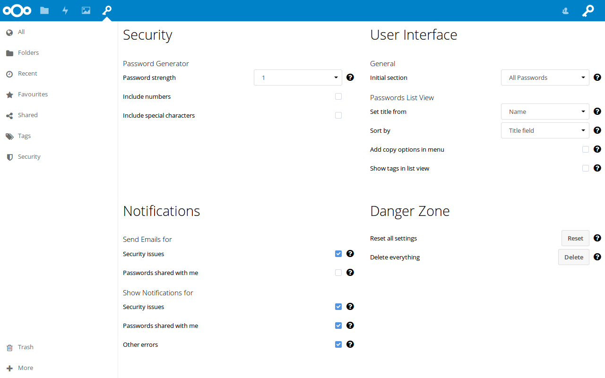

The settings can be found in `More > Settings` in the web interface.

## Security
### Password Generator
These settings define how the built-in password generator behaves.

##### Password strength
A higher password strength resulst in a more complex and longer password.