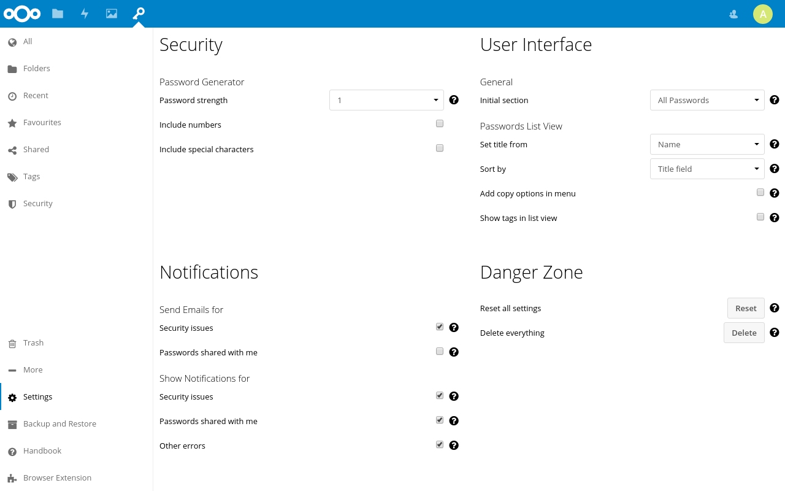

The settings section can be found under `More > Settings`.
These settings allow you to define how the app itself and the official clients behave.

## Expert Settings
Expert settings can be enabled by checking the "Expert Settings" box in the top right corner.

## Security
### Password Rules
Password rules activate additional security checks for passwords.
If a password fails one of these checks, it will be marked as weak.

> :star: The security status is updated once a day or when the password is changed.
> This means that changes are not applied immediately and the status of entries with the same password can differ.

##### Mark duplicates
If this option is enabled, passwords will be marked as weak if they appear more than once in your database.

##### Maximum age in days
Set a maximum age for passwords after which they will be marked as weak.
Setting the value to `0` will disable the check.

#### Security Check Hash (Expert Settings)
This setting defines how much of the SHA-1 hash used to compare each password against a list of known compromised passwords should be stored.
If the server is compromised, an attacker could use the SHA-1 hash to find the plain text value of a compromised password.
Storing a partial hash can reduce this risk, but also means that passwords may be marked as compromised despite being secure.
Storing no hash will prevent the password security check and the duplicate check from working.

Changes in this setting will be applied to new passwords immediately.
If a shorter value is selected, the hashes of existing passwords will be updated with the next password security check.
If a longer value is selected, the existing hashes will *not* be updated and remain short.
Changing this setting will have no impact on the status of passwords which were already marked as compromised.
The default value for this setting is defined by the administrator

### Password Generator
These settings define how the built-in password generator creates passwords.
You may be able to temporarily overwrite these settings when creating a password.
Your system administrator can choose which service is used to generate passwords.
Based on the service the actual generated password may differ.

##### Password strength
A higher number will increase the length and complexity of the generated password.
Every password will have at least 12 characters minimum.

##### Include numbers
If activated, the password generator will add numbers to the created password.

##### Include special characters
If activated, the password generator will add special characters like `$, €, @` to the created password.

### Login & Session
**Note:** This section is available if you have End-to-end encryption enabled

##### Keep me logged in
This setting controls how the app will keep the current session open before the encryption password needs to be entered again.
The option "Always" will keep the session open as long as the tab is open, 
"when i'm active" keeps it open as long as there is any kind of action in the tab and 
"when i'm working" only keeps the session open when there are requests to the server.

##### End session after (Expert Settings)
Controls how long the server should keep a session after the last contact to the client.
If the "Keep me logged in" setting is not set to "Always", this setting also controls how long the app will keep you logged in.

### Encryption
##### Server encryption mode (Expert Settings)
Choose the default server side encryption mode.

##### Client encryption mode (Expert Settings)
Choose the default client side encryption mode.

##### End-to-end Encryption
Set up end-to-end encryption for your passwords or change the encryption password.

##### Log in with WebAuthn
If end-to-end encryption is enabled and your browser supports it, you can log in with WebAuthn.
This stores your encryption passphrase in the browser and automatically retrieves it when you log in.
Log in with WebAuthn needs to be enabled on any device where you want to use it.
The set up process only stores the given passphrase in the browser, it does not check if it is the right passphrase.
If the passphrase is invalid, you will see an error message when you log in and need to enter the passphrase manually.

**Note:** Browsers may store your passphrase unencrypted in plain text and synchronize it using third party servers such as from Google (Chrome) or Microsoft (Edge).

## User Interface
##### Initial section
Here you can choose which section will be shown when you open the passwords app.
By default, the `Folders` section will be shown, but you can also select your `All Passwords`, `Favorites`, `Tags` or `Recent` passwords as inital section.

##### Show hidden custom fields (Expert Settings)
If enabled, this option will show hidden custom field (custom fields which start with an underscore "`_`") in the password details and edit form.
These fields are usually visually hidden and may be used for technical information, but they count towards the custom fields maximum limit.

### Password List View
These settings change how passwords are displayed in the list view.

##### Set title from
By default, the name of the password will be shown in the list view.
You can also select the `Website` to be used.

##### Single click action
This option defines the action which will be executed when you click on a password entry.
The options `Copy password`, `Copy username` and `Copy website` will copy the value of the corresponding attribute to your clipboard.
The option `Show details` will open the password details and the option `Edit password` will open the edit dialog.
If set to `Nothing`, the click action will be disabled.

##### Double click action
This option defines the action which will be executed when you double-click on a password entry.
The options `Copy password`, `Copy username` and `Copy website` will copy the value of the corresponding attribute to your clipboard.
The option `Show details` will open the password details and the option `Edit password` will open the edit dialog.
`Open website` will open the website for the password if one is given.
If set to `Nothing`, the double click action will be disabled.

##### Show shortcut button
This option adds one additional button to quickly access one action in the password list entry.
The option `Show details` will open the password details, `Show Share Tab` will open the share tab in the details view and the option `Edit password` will open the edit dialog.
The options `Copy password`, `Copy username` and `Copy website` will copy the value of the corresponding attribute to your clipboard.
`Open website` will open the website for the password if one is given.
The `Show Qrcode` option will open the Qrcode dialog which provides a qrcode with the password value.
The `Print password` option will trigger the printout, but is only available if the "Show print option" is enabled.

##### Add copy options in menu
If this option is enabled, the `⋯`-menu will contain two menu entries to copy the password and the username.
By default, these menu entries are not visible since you can copy the password by clicking on the name and the username by clicking twice.
On mobile devices the menu entries will always be shown regardless of whether this option enabled.

##### Show tags in the list view
You can show the tags for a password in the list view.
If you click on a tag the tag section will be opened and you can see all passwords with the tag.
This will increase the loading times if you have a lot of tags.
Also, the tags will not be shown on mobile devices.

##### Sort by (Expert Settings)
This option lets you choose which field will be used to sort passwords, when "Sort by Name" is selected in the list view.
By default, the title field from the `Set title from` option will be used.
But you can also have your passwords sorted by `Name`, `Website` independently of the title field.

##### Mousewheel click action (Expert Settings)
This option defines the action which will be executed when you click on a password entry with the mouse wheel.
The options `Copy password`, `Copy username` and `Copy website` will copy the value of the corresponding attribute to your clipboard.
The option `Show details` will open the password details and the option `Edit password` will open the edit dialog.
`Open website` will open the website for the password if one is given.
If set to `Nothing`, the double click action will be disabled.

##### Show print option (Expert Settings)
This setting adds an option to print the password to the list view and to the password details view.
Your device needs to be capable of printing for this to work.

**Note:** We don't recommend keeping printed copies of your passwords. They are easy to be found or stolen and might be shared accidentally e.g. when a photo is taken and the printout happens to be visible in the background.

##### Show username in list view (Expert Settings)
This option will always append your username after the title in the list view.
This option does not have any effect on the sorting of passwords.

### Password Detail View
These settings change the looks of the detail section for passwords.

##### Show website preview
If enabled, the detail section will have a preview of the main website attached to the password at the top.
This is only for desktops. On mobile devices this preview will not be shown.

### Search (Expert Settings)
The search section adds options to allow you to modify the behaviour of the password search.

##### Search as i type (Expert Settings)
If enabled, the search will start as soon as you start typing anywhere in the passwords app.
The search box will be focused automatically. (This of course excludes input fields)

##### Search everywhere with Enter (Expert Settings)
By default, passwords will search in the current section.
If this option is enabled, passwords will search everywhere if you hit the "Enter" button in the search box.

##### Always show search section (Expert Settings)
This option will make the search section always visible in the navigation on the left.

## Notifications
### Send Emails for
These settings enable or disable the emails sent to you by Passwords.

**Note:** Emails will only be sent if you have an email address associated with your account.

##### Security issues
Passwords checks whether your passwords are still secret or can be found in public data breaches every day.
If one or more of your passwords can be found open on the internet, Passwords will send you an email if this option is enabled.

##### Passwords shared with me
If this option is enabled, you will receive emails when someone shared a new password with you.

### Show Notifications for
##### Security issues
Passwords checks whether your passwords are still secret or can be found in public data breaches every day.
If one or more of your passwords can be found open on the internet, Passwords will show a notification if this option is enabled.
Passwords will also send a notification in any suspicious events concerning your account have been noticed.

##### Passwords shared with me
If this option is enabled, you will receive notifications when someone shared a new password with you.

##### Administration Issues (Administrators only)
If the app finds incorrect app settings or detects system requirement issues, you will receive a notification if you're an administrator.

##### Other errors (Expert Settings)
If a background operation (e.g. updating a shared password) fails, you will receive a notification.

##### Other errors
Tasks like sharing passwords, security checks and database housekeeping will run independently in the background.
If any errors happen during these tasks and this option is enabled, you will be notified.

## Danger Zone
The options in this section might irreversibly delete data from your account.
Therefore, it is recommended that you use them with caution.

##### Recover hidden items
This action will recover hidden items sich as passwords, folders and tags that are not visible in the Passwords app at all unless directly accessed.
You can choose to recover four types of hidden items:
 - **Passwords which aren't in a hidden folder**: will recover passwords which are hidden but are stored in a folder that is not hidden.
    If you moved a hidden password out of a hidden folder and it can no longer be seen in the app, this option will make the password visible in the folder it was moved to.
 - **All hidden passwords**: will recover any password marked as hidden, regardless of the folder it is in.
 - **All hidden folders**: will recover any folder that is marked as hidden. When used with "*Passwords which aren't in a hidden folder*", all passwords will be recovered.
 - **All hidden tags**: will recover any tag marked as hidden.

##### Reset all settings
This action will reset all settings stored in the Passwords app.
This will not only reset the settings visible here, but may also include settings from other apps or browser extension using the Passwords API.
Deleted settings can not be restored.

##### Delete everything
This action will delete all passwords, folders, tags and settings in your account.
It will also delete your private encryption key. This means that your data can not be restored.
You should make a backup and confirm that the backup works before you use this option.

**Note:** This option does not reset access tokens used by third party clients.
You can delete these in your personal settings.