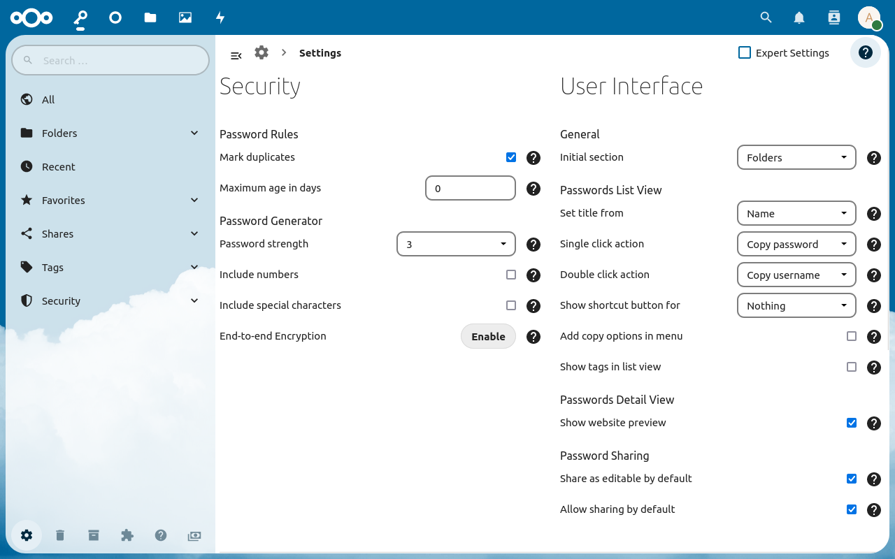

The settings section can be found under `More > Settings`.
These settings allow you to define how the app itself and the official clients behave.

## Advanced Settings
Expert settings can be shown by setting the drop-down in the top right corner to `Advanced`

## Security
### Password Rules
Password rules activate additional security checks for passwords.
If a password fails one of these checks, it will be marked as weak.

##### Mark duplicates
If you use a password more than once, this option will mark it as weak.

##### Maximum age in days
Set the maximum age allowed for your passwords. Setting the value to `0` will disable the check.

### Password Generator
These settings define how the built-in password generator creates passwords.
You may be able to temporarily overwrite these settings when creating a password.
Your system administrator can choose which service is used to generate passwords.
Based on the service the actual generated password may differ.

##### Password strength
A higher number will increase the length and complexity of the generated password.
Every password will have at least 12 characters minimum.

##### Include numbers
If activated, the password generator will add numbers to the created password.

##### Include special characters
If activated, the password generator will add special characters like `$, €, @` to the created password.

## User Interface
##### Initial section
Here you can choose which section will be shown when you open the passwords app.
By default the `Folders` section will be shown, but you can also select your `All Passwords`, `Favourites`, `Tags` or `Recent` passwords as inital section.

##### Show hidden custom fields (Advanced)
If enabled, this option will show hidden custom field (custom fields which start with an underscore "`_`") in the password details and edit form.
These fields are usually visually hidden and may be used for technical information, but they count towards the custom fields maximum limit.

### Password List View
These settings change how passwords are displayed in the list view.

##### Set title from
By default the name of the password will be shown in the list view.
You can also select the `Website` to be used.

##### Add copy options in menu
If this option is enabled, the `⋯`-menu will contain two menu entries to copy the password and the username.
By default these menu entries are not visible since you can copy the password by clicking on the name and the username by clicking twice.
On mobile devices the menu entries will always be shown regardless of whether this option enabled.

##### Show tags in the list view
You can show the tags for a password in the list view.
If you click on a tag the tag section will be opened and you can see all passwords with the tag.
This will increase the loading times if you have a lot of tags.
Also the tags will not be shown on mobile devices.

##### Sort by (Advanced)
This option lets you choose which field will be used to sort passwords, when "Sort by Name" is selected in the list view.
By default the title field from the `Set title from` option will be used.
But you can also have your passwords sorted by `Name`, `Website` independently from the title field.

##### Single click action (Advanced)
This option defines the action which will be executed when you click on a password entry.
The options `Copy password`, `Copy username` and `Copy website` will copy the value of the corresponding attribute to your clipboard.
The option `Show details` will open the password details and the option `Edit password` will open the edit dialog.
If set to `Nothing`, the click action will be disabled.

##### Double click action (Advanced)
This option defines the action which will be executed when you double click on a password entry.
The options `Copy password`, `Copy username` and `Copy website` will copy the value of the corresponding attribute to your clipboard.
The option `Show details` will open the password details and the option `Edit password` will open the edit dialog.
If set to `Nothing`, the double click action will be disabled.

##### Show username in list view (Advanced)
This option will always append your username after the title in the list view.
This option does not have any effect on the sorting of passwords.

### Password Detail View (Advanced)
These settings change the looks of the detail section for passwords.

##### Show website preview (Advanced)
If enabled, the detail section will have a preview of the main website attached to the password at the top.
This is only for desktops. On mobile devices this preview will not be shown.

### Search (Advanced)
The search section adds options to allow you to modify the behaviour of the password search.

##### Search as i type (Advanced)
If enabled, the search will start as soon as you start typing anywhere in the passwords app.
The search box will be focused automatically. (This of course excludes input fields)

##### Search everywhere with Enter (Advanced)
By default, passwords will search in the current section.
If this option is enabled, passwords will search everywhere if you hit the "Enter" button in the search box.

##### Always show search section (Advanced)
This option will make the search section always visible in the navigation on the left.

## Notifications
### Send Emails for
These settings enable or disable the emails sent to you by Passwords.

**Note:** Emails will only be sent if you have an email address associated with your account.

##### Security issues
Passwords checks whether your passwords are still secret or can be found in public data breaches every day.
If one or more of your passwords can be found open on the internet, Passwords will send you an email if this option is enabled.

##### Passwords shared with me
If this option is enabled, you will receive emails when someone shared a new password with you.

### Show Notifications for
##### Security issues
Passwords checks whether your passwords are still secret or can be found in public data breaches every day.
If one or more of your passwords can be found open on the internet, Passwords will show a notification if this option is enabled.
Passwords will also send a notification in any suspicious events concerning your account have been noticed.

##### Passwords shared with me
If this option is enabled, you will receive notifications when someone shared a new password with you.

##### Other errors (Advanced)
If a background operation (e.g. updating a shared password) fails, you will receive a notification.

##### Other errors
Tasks like sharing passwords, security checks and database housekeeping will run independently in the background.
If any errors happen during these tasks and this option is enabled, you will be notified.

## Danger Zone
The options in this section might irreversibly delete data from your account.
Therefore it is recommended that you use them with caution.

##### Reset all settings
This option will delete all settings stored in the passwords app.
This will not only reset the settings visible here, but may also include settings from other apps or browser extension using the Passwords API.
Deleted settings can not be restored.

##### Delete everything
This option will delete all passwords, folders, tags and settings in your account.
It will also delete your private encryption key. This means that your data can not be restored.
You should make a backup and confirm that the backup works before you use this option.

**Note:** This option does not reset access tokens used by third party clients.
You can delete these in your personal settings.