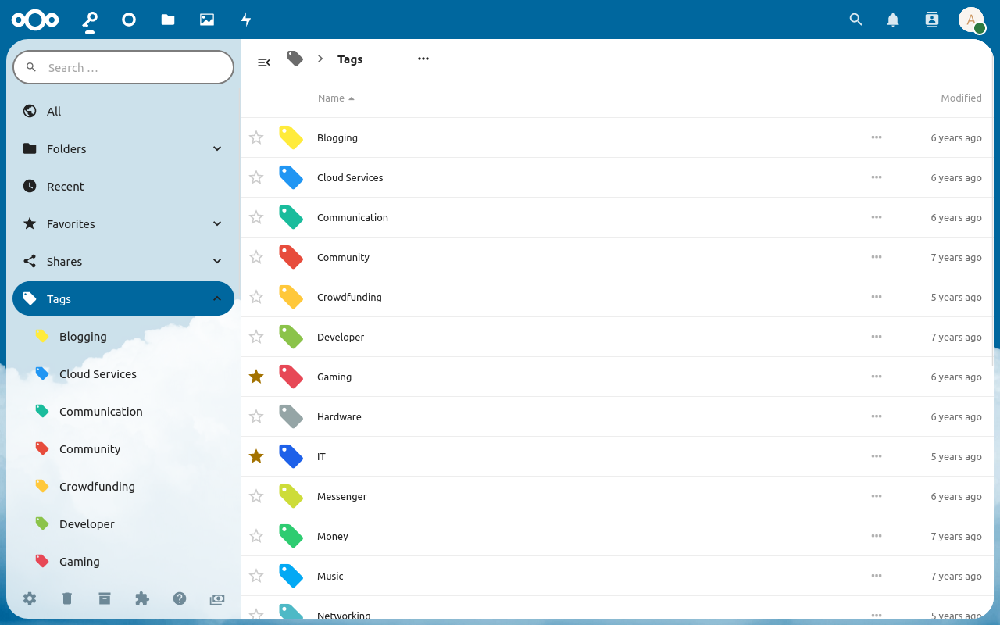

Tags can be used to classify passwords which belong to a specific topic.
For example your "Slack" password could be in your "Work" folder and your "Discord" password in your "Private" folder, but both could be assigned to the tag "Messenger".
This makes passwords that relate to each other easier to find.
You could also use tags like "Outdated" or "Second Account" to mark passwords used for specific use cases. 

## Tags in the list view

All tags can be viewed in the tag section.
To view all tagged passwords for a tag, click on it on the list view.

##### The "⋯"-Menu
With the "More" menu, you can access all other options available for the folder.
The "Edit" option will open the "Edit Tag" window where you can change the name and color.
The "Delete" option will move the tag.

##### Tags in the main view

If the [option](./Settings#show-tags-in-the-list-view) is enabled, listing of passwords will show the tags associated with them.
You can then click on the tag to see all related passwords.

**Note:** Please be aware that this option may slow the app down.

## Creating a tag
##### Using the tag creation dialog 

Click on the "⋯"-Button in the breadcrumb navigation in the tag section and select "New Tag" to open the tag creation dialog.
Enter the name of the tag and click and choose a custom color if wanted.
Then click on on "Yes" to create the tag.

##### Creating tags automatically
Tags will be created automatically if they are assigned to a password but don't exist.

To do os, open the detail view of a password and write the name of the tag in the "Add Tags..." area.
When you click "Enter", the tag will be created and a random color will be assigned.

## Deleting tags
Once you select the "Delete" option from the "⋯"-Menu, the tag.
It will disappear from all passwords it was assigned to.
You can still find the tag in the trash and see all passwords it was assigned to.
If you choose to restore the tag, it will also appear in the passwords again.

**Note:** Deleting a tag from the trash will delete the tag *only* and *not* the passwords it was assigned to.